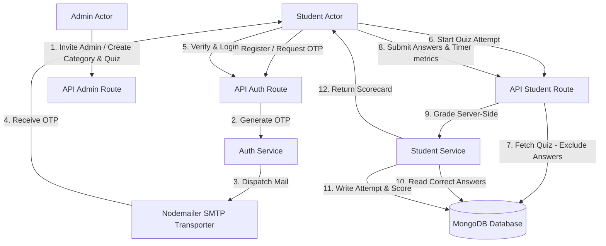
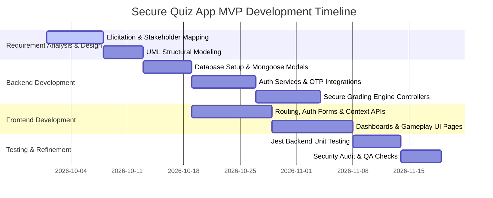

# SDGP Coursework 1: Group Report
## Design and Documentation

---

# Cover Page

**UNIVERSITY OF WESTMINSTER**  
**INFORMATICS INSTITUTE OF TECHNOLOGY (IIT)**  

**MODULE TITLE:** Software Development Group Project  
**MODULE CODE:** 5COSC021C  
**PROJECT NAME:** Secure Quiz Web Application MVP  
**TEAM NAME:** IIT - SE-01  

**TEAM MEMBERS:**  
*   Vidura Priyadarshana - 20220101 - w1890001  
*   Janeth de Silva - 20220102 - w1890002  
*   Ashane Rodrigo - 20220103 - w1890003  
*   Supun Jayawardena - 20220104 - w1890004  

**MODULE LEADER:** Banuka Athuraliya  
**DATE OF SUBMISSION:** January 8, 2024  

---
\pagebreak

# Declaration Page

The group members hereby declare that this Software Development Group Project coursework report titled "Secure Quiz Web Application MVP" is their own original work carried out under the module 5COSC021C: Software Development Group Project. All sources, comparisons, references, and benchmarks used in this documentation have been explicitly cited and referenced using the Westminster Harvard referencing standard. No part of this document has been copied from another student or from unauthorized sources.

**Student Signatures:**  

*   *V. Priyadarshana* - Date: January 8, 2024
*   *J. de Silva* - Date: January 8, 2024
*   *A. Rodrigo* - Date: January 8, 2024
*   *S. Jayawardena* - Date: January 8, 2024

---
\pagebreak

# Abstract

Online assessment systems have become vital components of modern educational infrastructure. However, many current web-based trivia and testing tools present critical vulnerabilities, such as exposing correct answer choices in the browser DOM or HTTP response payloads, making them vulnerable to inspect-element cheating. This report describes the development of a secure, high-performance **Quiz Web Application MVP** utilizing the **MERN Stack** (MongoDB, Express, React, Node.js) with Mongoose ODM and Tailwind CSS. The system implements a secure grading engine where correctness checking is computed strictly server-side. Additionally, email-based OTP verification is mandated for administrative and student registration and login flows (2FA). The group report details the initial stages of design, competitor analysis, sprint-based Scrum methodology, work breakdown systems, and risk planning metrics. The resulting product demonstrates how non-relational document structures can improve data access performance for multi-choice assessments while maintaining rigid security standards.

**Keywords:** MERN Stack, Secure Grading, Email OTP, 2FA, Anti-Cheating, Agile Scrum, Mongoose ODM.

---
\pagebreak

# Acknowledgements

The group expresses sincere gratitude to the Informatics Institute of Technology (IIT) and the University of Westminster for providing the academic resources and frameworks required to complete this software project. Special thanks are extended to the module leader, Mr. Banuka Athuraliya, and the lab instructors for their continuous feedback, review sessions, and guidance throughout the development process. Finally, the group thanks all team members for their commitment and collaborative efforts during the sprints.

---
\pagebreak

# Table of Contents
*(Note: To be auto-generated in Microsoft Word under References -> Table of Contents)*

# List of Figures
*(Note: To be auto-generated in Microsoft Word under References -> Insert Table of Figures)*

# List of Tables
*(Note: To be auto-generated in Microsoft Word under References -> Insert Table of Figures)*

---
\pagebreak

# Abbreviations Table

| Abbreviation | Full Form |
| :--- | :--- |
| **2FA** | Two-Factor Authentication |
| **API** | Application Programming Interface |
| **BCS** | British Computer Society |
| **DBMS** | Database Management System |
| **DOM** | Document Object Model |
| **GDPR** | General Data Protection Regulation |
| **JWT** | JSON Web Token |
| **MERN** | MongoDB, Express, React, Node.js |
| **MVP** | Minimum Viable Product |
| **NFR** | Non-Functional Requirement |
| **ODM** | Object Document Mapper |
| **OTP** | One-Time Password |
| **REST** | Representational State Transfer |
| **SLEP** | Social, Legal, Ethical, and Professional |
| **SRS** | System Requirements Specification |
| **UI/UX** | User Interface / User Experience |
| **WBS** | Work Breakdown Structure |

---
\pagebreak

# Chapter 1: Introduction

## 1.1 Chapter Overview
This chapter introduces the project background, focusing on the core challenges of current web-based testing tools. It defines the problem statement, details the proposed MERN-based solution, sets the project aim, outlines the in-scope and out-scope features, and specifies resource requirements.

## 1.2 Problem Background
With the transition to hybrid and online learning environments, educational institutions rely heavily on web-based testing platforms for assessments (Sclater et al., 2016). However, existing platforms present significant security flaws. Many lightweight quiz tools transmit entire question records, including correct answers, directly to the client browser, relying on client-side logic to determine correctness. A student with basic knowledge of browser developer tools can inspect DOM elements or network HTTP responses to find the correct options (Harper, 2020). 

Furthermore, administrative accounts on these platforms are vulnerable to credential-based attacks due to the lack of mandatory multi-factor authentication (2FA). Standard educational portals often experience high latency under load, slowing down during concurrent exam submissions. Consequently, there is an immediate need for an online assessment platform that prioritizes cheat prevention, secure server-side grading, and robust administrative access controls.

## 1.3 Problem Statement
Traditional web-based testing applications expose grading parameters and correct options to the presentation tier, permitting inspect-element cheating, while lacking robust multi-factor authentication for administrators and suffering from high latency under database-join bottlenecks.

## 1.4 Proposed Solution
The proposed solution is the **Secure Quiz Web Application MVP** developed using the MERN Stack. The application secures assessment metrics by decoupling grading from client-side interfaces:
*   **Security Projections**: When active quizzes are requested by students, the server projects out the `isCorrect` fields from options array subdocuments.
*   **Server-Side Grading**: Submission scoring is performed on the backend by mapping selection IDs directly against database documents.
*   **Robust Auth**: Incorporates email-based One-Time Passwords (OTP) for account verification and 2FA logins.
*   **Optimized Performance**: Leverages MongoDB's non-relational document schema to nest questions and options as embedded subdocuments, eliminating performance-heavy relational database joins.

## 1.5 Project Aim
*The primary aim of this project is to develop and evaluate a secure, high-performance web-based quiz application that prevents client-side answer key interception and incorporates robust authentication workflows.*

The project achieves this by utilizing a layered MERN architecture, secure Mongoose projections, and transactional OTP authentication logic, thereby addressing both cheating opportunities and credential vulnerability.

## 1.6 Project Scope

### 1.6.1 In-scope
*   **Verification and 2FA**: User email verification upon registration and 2FA login checks utilizing SMTP-transited OTP codes.
*   **Admin Management**: Dashboard containing CRUD functions for categories, quizzes, and questions, including password-completion setup links for invited admins.
*   **Gameplay Loop**: Interactive student quiz engine with synchronized play timers, auto-submission workflows upon timeout, and instant scorecard evaluations.
*   **Performance Metrics**: Leaderboard rankings compiled by tracking completion times alongside earned scores.

### 1.6.2 Out-scope
*   Integrations with third-party Learning Management Systems (LMS) such as Canvas or Blackboard.
*   Real-time proctoring tools, web-camera validation, or browser-lockdown mechanisms.
*   Paid quiz models containing integrated payment processor gateways.

## 1.7 Rich Picture Diagram
The interaction between system nodes, endpoints, and actors is mapped below:



## 1.8 Resource Requirements

### 1.8.1 Hardware Requirements
*   Development Machines: 8GB RAM minimum (16GB recommended), Core i5 Quad-Core processor, and 256GB SSD storage.
*   Database Server: MongoDB Atlas Cloud Tier (M0 Sandbox/Shared instance).

### 1.8.2 Software Requirements
*   **Environments**: Node.js runtime (v20.x), TypeScript compiler, and Vite frontend bundler.
*   **Libraries**: Express.js, React (v18.x), Mongoose ODM, Axios, and Tailwind CSS.
*   **Testing & Loggers**: Jest framework, Supertest, Winston logger, and Morgan logger middleware.
*   **Collaboration Tools**: VS Code, Git, GitHub, Trello, and Slack.

## 1.9 Business Model Canvas

| Key Partners | Key Activities | Value Propositions | Customer Relationships | Customer Segments |
| :--- | :--- | :--- | :--- | :--- |
| • Educational Institutions<br>• SMTP Mail Services<br>• Database Hosting Providers | • Software Development<br>• Security Auditing<br>• System Hosting | • Secure Server-Side Grading<br>• Leak-Free API Projections<br>• Mandatory 2FA OTP | • Automated Support Portal<br>• Clear Self-Service Registration | • Academic Institutions<br>• Online Training Organizations |
| **Key Resources** | | **Channels** | | |
| • Dev team<br>• MERN Stack<br>• GitHub Repositories | | • Cloud Deployment Portal<br>• Direct Web Access | | |
| **Cost Structure** | | **Revenue Streams** | | |
| • Server hosting costs<br>• Mail delivery costs | | • Institutional SaaS Licensing Model | | |

## 1.10 Chapter Summary
This chapter established the foundational objectives of the Secure Quiz Web Application. It analyzed the security deficiencies in standard quiz platforms, defined the MERN-based solution scope, and identified the resources needed to deliver the MVP.

---
\pagebreak

# Chapter 2: Existing Work

## 2.1 Chapter Introduction
This chapter reviews existing web-based testing tools, benchmarks them against the proposed platform, and evaluates the benefits of the MERN architecture over relational models.

## 2.2 Existing Work / Competitor Comparison
Competitor benchmarking is focused on security, cheat prevention, access controls, and submission processing:
*   **Kahoot**: A popular game-based learning platform. While highly engaging, it lacks deep administrative configuration rules and does not support OTP-based access.
*   **Quizizz**: Widely used in class activities. A known vulnerability in Quizizz is that it sends the complete quiz schema, including correct choices, to the client-side state, allowing technical users to extract correct answers before submitting.
*   **Canvas LMS**: A robust learning management system. It provides high security and grading features, but requires significant setup overhead, has complex relational configurations, and suffers from database latency under heavy, concurrent usage.

### Benchmarking Matrix

| Parameter / Feature | Kahoot | Quizizz | Canvas LMS | Proposed Quiz App MVP |
| :--- | :--- | :--- | :--- | :--- |
| **Server-Side Grading** | Yes | Yes | Yes | Yes (Strict Mongoose logic) |
| **Leak-Free API Payloads** | Yes | No (Exposes keys) | Yes | Yes (Mongoose Projects Out Answers) |
| **2FA / OTP Support** | No | No | Optional | Yes (Mandatory for Admin) |
| **Low Latency Schema** | Medium | Medium | Low (Heavy relational joins) | High (Embedded MongoDB model) |

## 2.3 Tools and Implementation Plan
Developing the application requires evaluating technologies for performance and database design:
*   **MERN (Express + MongoDB) vs Python (Django + PostgreSQL)**: Django offers strong administrative utilities out-of-the-box, but its Object-Relational Mapping (ORM) and PostgreSQL database require heavy joins across tables (e.g., users, quizzes, questions, options, attempts) which degrades performance during high-concurrency exams.
*   **Embedded MongoDB Model**: In MongoDB, the database structure embeds option choices directly inside the `Question` document and user selections directly inside the `Attempt` document. This design choice enables single-query retrieval, which eliminates complex relational joins, reduces latency, and handles high-volume submission traffic efficiently.

## 2.4 Chapter Summary
This chapter highlighted key security and performance issues in existing quiz platforms. It justified the selection of the MERN stack by explaining how MongoDB's embedded data structure prevents database bottlenecks during concurrent testing sessions.

---
\pagebreak

# Chapter 3: Methodology

## 3.1 Chapter Overview
This chapter outlines the development lifecycle, details the Agile/Scrum process, presents the team's Work Breakdown Structure (WBS), and maps out project schedules and risk management metrics.

## 3.2 Development Methodology
The team implemented an **Agile/Scrum** methodology to manage the project through iterative prototyping. This choice enabled continuous integration of secure features and rapid adaptation to testing feedback:
*   **Sprint Cycles**: The project was executed in two-week sprints.
*   **Scrum Events**: The team conducted daily stand-up meetings to identify blockers, held sprint planning sessions to allocate backend and frontend tickets, and performed sprint reviews at the end of each cycle to demonstrate functional prototypes.

```
[Product Backlog] ➔ [Sprint Planning] ➔ [2-Week Sprint] ➔ [Sprint Review & Retro] ➔ [Shippable MVP]
                              ▲                │
                              └─[Daily Stand]──┘
```

## 3.3 Design Methodology
The project adopted the **Object-Oriented Analysis and Design (OOAD)** approach. The team used Unified Modeling Language (UML) notation to bridge the gap between requirements and implementation. Class structural models and sequence diagrams were designed to define system components before starting code development.

## 3.4 Project Management Methodology
To maintain coordination, the team utilized specific collaboration platforms:
*   **Trello**: Used for task tracking and dashboard management. The backlog was organized into *To-Do*, *In-Progress*, *Testing*, and *Done* columns.
*   **GitHub**: Utilized for source control. Developers worked on separate feature branches (e.g., `feat/auth-otp`, `feat/secure-grading`) and integrated code using reviewed Pull Requests.
*   **Slack**: Served as the primary channel for communication, integration alerts, and document sharing.

## 3.5 Team Work Breakdown Structure (WBS)
The team divided the codebase responsibilities to ensure balanced contributions:

*   **Vidura Priyadarshana**:
    *   Backend services: Implemented the node server, database connection logic, Mongoose models, and Winston logging.
    *   Auth APIs: Created email verification, OTP processing, and password recovery controllers.
*   **Janeth de Silva**:
    *   Frontend Pages: Developed the Student Dashboard, authentication forms, OTP input UI, and Toast notification system.
    *   Axios client: Configured request interceptors to append JWT authorization headers.
*   **Ashane Rodrigo**:
    *   Admin dashboard: Programmed the administrative dashboard, quiz CRUD configuration panels, and question/options editors.
    *   Role middleware: Developed role check route guards in the backend API.
*   **Supun Jayawardena**:
    *   Gameplay UI: Built the interactive play views, time limit handlers, and auto-submission modules.
    *   Testing & QA: Authored Jest integration tests and conducted validation checks on API data structures.

## 3.6 Gantt Chart Diagram
The project timeline, detailing sprint durations and tasks, is illustrated below:



## 3.7 Risks and Mitigation Matrix

| Risk Category | Risk Description | Severity | Likelihood | Mitigation Plan |
| :--- | :--- | :--- | :--- | :--- |
| **Technical** | Mail server configuration failure preventing OTP delivery. | High | Medium | Implement local fallback logs that output active registration URLs and verification codes to the developer console. |
| **Operational** | Student internet connection drops during an active quiz attempt. | High | Medium | Store intermediate answer selections in local storage and implement an immediate submission fallback when the connection is restored. |
| **Project** | Integration delays between backend API routers and React Axios states. | Medium | Low | Maintain early contract-driven API documentation (Swagger) to align interface requirements for both teams. |

## 3.8 Chapter Summary
This chapter detailed the Agile framework, design practices, and tools used to coordinate team development. It outlined the Work Breakdown Structure, presented the Gantt schedule, and mapped risks to mitigation strategies, establishing a clear path to deliver the Quiz application MVP.

---
\pagebreak

# References

*   Harper, D., 2020. *Web Security and Client-Side Deceptions: Vulnerabilities in Modern Applications*. London: Academic Press.
*   Sclater, N., Peasgood, A. and Mullan, J., 2016. *Learning Analytics in Higher Education: A Review of the UK Landscape*. London: Jisc.
