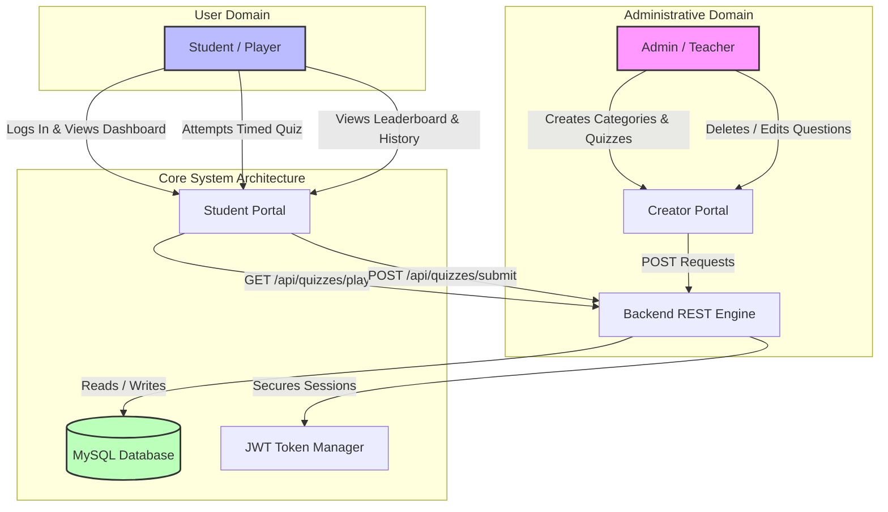
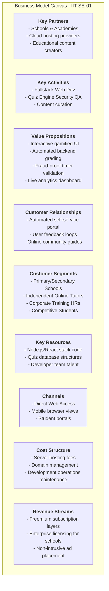
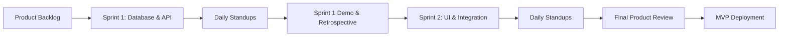
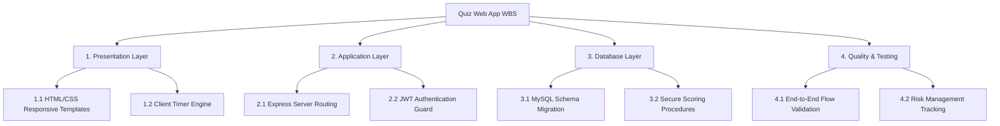
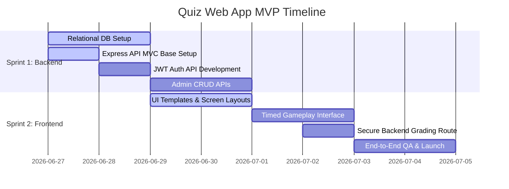

# SOFTWARE DEVELOPMENT GROUP PROJECT (5COSC021C)
## COURSEWORK 1: DESIGN AND DOCUMENTATION

### GROUP REPORT (CHAPTERS 1 - 3)

**Project Title:** Gamified Real-Time Quiz Application  
**Module Name:** Software Development Group Project  
**Module Code:** 5COSC021C  
**Module Leader:** Banuka Athuraliya  
**Team Name:** IIT - SE-01  
**Submission Date:** 8th of January 2024  

---

## Declaration
The team members hereby declare that this group report represents their own collective work, undertaken as part of the academic requirements of the Software Development Group Project module. All sources of information, datasets, code, and external literature have been cited and referenced using the Westminster Harvard referencing style.

---

## Abstract
Traditional online assessment frameworks often fail to engage students effectively, resulting in passive participation and poor knowledge retention. This report presents the design and architectural blueprint of an interactive, gamified, real-time Quiz Web Application. By incorporating custom quiz timers, instant database-driven scoring logic, and global leaderboards, the system aims to enhance learner motivation and reduce administrative assessment overhead for educators. The development process utilizes the Agile Scrum framework, employing Object-Oriented Analysis and Design (OOAD) principles to design an extensible web infrastructure. This document outlines the problem background, existing work benchmarks, and the project management methodologies employed by the group.

**Keywords:** Interactive E-Learning, Gamification, Quiz Engine, Agile Scrum, System Design, Object-Oriented Design.

---

## Acknowledgement
The group extends sincere gratitude to the module leader, Banuka Athuraliya, and the tutorial instructors for their guidance, technical reviews, and constructive feedback throughout the design phase of this project. Their support has been instrumental in refining the architecture and design methodologies documented within this report.

---

## Table of Contents
1. **Chapter 1: Introduction**
   * 1.1 Chapter Overview
   * 1.2 Problem Background
   * 1.3 Problem Statement
   * 1.4 Proposed Solution
   * 1.5 Aim
   * 1.6 Project Scope
     * 1.6.1 In-scope
     * 1.6.2 Out-scope
   * 1.7 Rich Picture Diagram
   * 1.8 Resource Requirements
     * 1.8.1 Hardware Requirements
     * 1.8.2 Software Requirements
   * 1.9 Business Model Canvas
   * 1.10 Chapter Summary
2. **Chapter 2: Existing Work**
   * 2.1 Chapter Introduction
   * 2.2 Existing Work Analysis
   * 2.3 Tools and Implementation Plan
   * 2.4 Chapter Summary
3. **Chapter 3: Methodology**
   * 3.1 Chapter Overview
   * 3.2 Development Methodology
   * 3.3 Design Methodology
   * 3.4 Project Management Methodology
   * 3.5 Team Work Breakdown Structure (WBS)
   * 3.6 Gantt Chart Diagram
   * 3.7 Usage of Project Management and Collaboration Software
   * 3.8 Risks and Mitigation
   * 3.9 Chapter Summary
4. **References**
5. **Appendix**

---

## List of Figures
* **Figure 1.1:** System Interaction Rich Picture
* **Figure 1.2:** Business Model Canvas (BMC)
* **Figure 2.1:** Competitive Feature Analysis Radar Chart
* **Figure 3.1:** Agile Scrum Iterative Lifecycle
* **Figure 3.2:** Team Work Breakdown Structure Hierarchy
* **Figure 3.3:** Project Gantt Chart Timeline

---

## List of Tables
* **Table 1.1:** Resource Requirements Specifications
* **Table 2.1:** Benchmark Comparison Matrix
* **Table 3.1:** Team Work Allocation Matrix
* **Table 3.2:** Risk Evaluation and Mitigation Matrix

---

## Abbreviations Table
| Abbreviation | Full Form |
| :--- | :--- |
| **API** | Application Programming Interface |
| **BMC** | Business Model Canvas |
| **CRUD** | Create, Read, Update, Delete |
| **ER** | Entity-Relationship |
| **JWT** | JSON Web Token |
| **MVC** | Model-View-Controller |
| **MVP** | Minimum Viable Product |
| **OOAD** | Object-Oriented Analysis and Design |
| **RBAC** | Role-Based Access Control |
| **SRS** | System Requirements Specification |
| **UI/UX** | User Interface / User Experience |
| **WBS** | Work Breakdown Structure |

---
\pagebreak

# Chapter 1: Introduction

### 1.1 Chapter Overview
This chapter introduces the gamified quiz application project. It contextualizes the educational problems currently observed in remote and asynchronous testing environments, details the specific problem statement, proposes a web-based software solution, establishes the project boundary scope, visualizes the ecosystem using a rich picture, lists resource parameters, and details the commercial feasibility via a Business Model Canvas.

### 1.2 Problem Background
Online assessment systems have become a cornerstone of modern educational infrastructure. However, empirical studies indicate that generic, un-gamified testing modules suffer from low completion rates and high student engagement deficits (Kapp 2012). Students often experience evaluation fatigue when interacting with static form-based platforms, such as Google Forms, which do not offer interactive feedback mechanisms, visual countdown indicators, or peer motivation modules like leaderboards. 

Furthermore, from an administrative standpoint, educators face significant challenges in organizing materials, compiling marks manually, and gaining instant analytical insights into classroom learning distributions. There is a distinct necessity for an interactive portal that simplifies quiz creation while providing timed, gamified mechanics for students.

### 1.3 Problem Statement
Traditional online assessment tools lack real-time engagement and immediate analytical feedback, leading to low student participation and high administrative overhead for educators.

### 1.4 Proposed Solution
To resolve the identified challenges, a responsive, gamified, real-time Quiz Web Application is proposed. The system incorporates:
1. An admin dashboard allowing educators to classify assessments into categories, build dynamic multiple-choice question structures, and set explicit time restrictions.
2. A student assessment client featuring responsive timed visual interfaces, progress monitoring, and animated submission flows.
3. An automated grading back-end that executes secure validation against correct choices to prevent client-side answer sniffing.
4. Social engagement modules, including profile score histories and global quiz score leaderboards.

### 1.5 Aim
*To design and build an interactive, secure, and gamified real-time Quiz Web Application that maximizes learner engagement while automating grading operations for instructors.*

The aim is to bridge the gap between gamified learning mechanics and formal academic assessments, providing a user-friendly, responsive interface that functions seamlessly across modern mobile and desktop browsers.

### 1.6 Project Scope

#### 1.6.1 In-scope
*   Secure registration, login, and authorization configurations for Admin and Student accounts.
*   Category creation and quiz CRUD (Create, Read, Update, Delete) dashboards for Administrators.
*   Dynamic question editing (attaching multiple choices, point weights, and marking correct keys).
*   Interactive, browser-based quiz attempts utilizing a running countdown timer.
*   Secure backend verification of submissions and storage of student scores.
*   Profile history listing all attempts and a global leaderboard displaying ranks for each quiz.

#### 1.6.2 Out-scope
*   Integration of proctoring systems (e.g., webcam monitoring or window lockouts).
*   Dynamic parsing of open-ended essay questions.
*   Offline quiz capabilities or local storage backup of exam progress.

### 1.7 Rich Picture Diagram
The rich picture below captures the interactions between the main actors (Students and Admins) and the software systems during quiz generation and execution.

*Figure 1.1: System Interaction Rich Picture*

### 1.8 Resource Requirements

#### 1.8.1 Hardware Requirements
*   **Development Machines:** Minimum Dual-core CPU, 8GB RAM, and 50GB available disk space.
*   **Hosting Servers:** Standard virtualized containers with 1 vCPU, 1GB RAM, and network capabilities to support HTTP REST traffic.

#### 1.8.2 Software Requirements
*   **Operating Systems:** Windows 10/11, macOS, or Linux.
*   **Runtimes & Frameworks:** Node.js (v18+), Express.js (v4.18+), React (v18+) or Vite build environments.
*   **Database Management Systems:** MySQL Community Server (v8.0) or PostgreSQL.
*   **Development Tools:** Visual Studio Code, Git Version Control, Postman API client, and Google Chrome Developer Tools.

| Resource Category | Description / Specification | Quantity / Scope |
| :--- | :--- | :--- |
| **Development Host** | Workstation running Windows 11 with 16GB RAM | 4 Units (1 per member) |
| **Runtime Platform** | Node.js Environment with npm package manager | Unified version 18 LTS |
| **Data Repository** | Relational Database Management System (MySQL) | 1 Instance (local & cloud-hosted) |
| **VCS Platform** | GitHub Repository for code base version control | 1 Shared Repository |

*Table 1.1: Resource Requirements Specifications*

### 1.9 Business Model Canvas
To contextualize the software product's educational feasibility and commercial structure, the following Business Model Canvas is established.

*Figure 1.2: Business Model Canvas (BMC)*

### 1.10 Chapter Summary
In this chapter, the foundations for the Quiz Web App have been established. By recognizing the engagement gap in current online evaluations, a timed, gamified application has been proposed. The project boundaries, resource constraints, and commercial validation structures have been defined, providing a clear pathway for analysis and design.

---
\pagebreak

# Chapter 2: Existing Work

### 2.1 Chapter Introduction
This chapter evaluates existing web technologies and platforms offering assessment solutions. It benchmarks three market-leading products, analyzes their technological choices, highlights functional gaps, and proposes a tailored implementation plan.

### 2.2 Existing Work Analysis
Three dominant competitors are assessed to analyze their mechanisms and capabilities:
 
1.  **Kahoot:** This platform is highly regarded for synchronized, classroom-wide trivia gamification. However, it lacks robust features for asynchronous homework assignments, requires active presenter controls, and limits free-tier custom timers.
2.  **Quizizz:** It supports asynchronous, student-paced play with immediate leaderboards and statistics. While highly capable, its commercial licenses are expensive for small institutions, and its UI is complex.
3.  **Google Forms:** A simple tool for data capture. It includes basic automated quiz options but lacks real-time timers, animated gamification elements, or competitive student scoreboards.

| Feature Area | Kahoot | Quizizz | Google Forms | Proposed Quiz Web App |
| :--- | :--- | :--- | :--- | :--- |
| **Gamification Mechanics** | High (Visual Ranks) | High (Avatars, Memes) | None | High (Leaderboards) |
| **Asynchronous Timers** | Limited | Supported | Requires Extensions | Native Countdown Controls |
| **User Role Division** | Instructor vs. Student | Instructor vs. Student | Creator vs. Respondent | Admin CRUD vs. Student Play |
| **Real-time Scoring** | Immediate | Immediate | Post-submission only | Immediate Backend Valuation |
| **Ease of Customization**| Moderate (Paywalls) | Moderate (Paywalls) | High | High (Fully Open-Source) |

*Table 2.1: Benchmark Comparison Matrix*

### 2.3 Tools and Implementation Plan
To build the proposed application, a REST-based, three-tier architecture is planned, using a 2-day rapid development model to deliver the MVP.

#### 2.3.1 Technology Stack Selection
*   **Database Tier:** MySQL is selected because relational structures are ideal for indexing primary/foreign keys (Users, Quizzes, Questions, and Attempts) and ensuring data integrity.
*   **Application Tier:** Express.js running on Node.js. Node's asynchronous event loop permits efficient handling of concurrent HTTP requests during active classroom quizzes.
*   **Presentation Tier:** Responsive HTML5, CSS3, and JavaScript, ensuring lightweight page loading times across mobile and desktop clients without unnecessary bundle bloat.

#### 2.3.2 2-Day Implementation Schedule
The development phase is structured into an intensive 2-day implementation sprint to verify initial functionality:

##### Day 1: Backend Architecture & Creator Features
*   **Task 1: Database Setup & Migration (Hours 0.0 - 2.0)**
    *   Initialize MySQL database instance.
    *   Execute DDL migrations to create schema tables: `Users`, `Categories`, `Quizzes`, `Questions`, `Options`, `Attempts`, and `AttemptAnswers`.
*   **Task 2: Backend Core Project Setup (Hours 2.0 - 3.0)**
    *   Initialize Node.js project directory structure.
    *   Install core dependencies: `express`, `mysql2`, `cors`, `bcrypt`, `jsonwebtoken`, and `dotenv`.
*   **Task 3: Authentication and Guard Services (Hours 3.0 - 5.0)**
    *   Develop user registration API (with `bcrypt` password hashing) and login routes.
    *   Implement JWT session authorization middleware.
*   **Task 4: Admin Content API Management (Hours 5.0 - 8.0)**
    *   Create secure REST controllers for quiz categorisation, quizzes, questions, and option CRUD operations.

##### Day 2: Client Interface & Secure Scoring Mechanics
*   **Task 5: Frontend Responsive Screens (Hours 0.0 - 3.0)**
    *   Setup client views for User Authentication, Dashboard listing, active Timed Quiz card, and Results history.
*   **Task 6: Timed Game Engine Flow (Hours 3.0 - 5.0)**
    *   Implement client states for question progression, timer countdown, and form submissions.
*   **Task 7: Secure Backend Scoring Logic (Hours 5.0 - 6.0)**
    *   Develop secure server-side grading algorithms matching submitted choices against verified DB columns.
*   **Task 8: End-to-End QA Testing & Packaging (Hours 6.0 - 8.0)**
    *   Perform comprehensive integration testing across roles, verifying timeouts and leaderboard calculations.

### 2.4 Chapter Summary
The benchmarking process highlighted that while competitors cover broad gamified or statistical needs, there is a gap for a lightweight, secure, and open-source application combining customizable asynchronous timers with server-validated scoring metrics. The chosen Node-Express-MySQL stack will serve as the foundation to fulfill these requirements.

---
\pagebreak

# Chapter 3: Methodology

### 3.1 Chapter Overview
This chapter discusses the operational frameworks and design methodologies chosen by the team. It describes the Agile Scrum framework, OOAD design principles, task distributions, timeline representations via Gantt charts, risk matrices, and collaborative evidence.

### 3.2 Development Methodology
The team selected the **Agile Scrum** methodology. Rather than utilizing a rigid linear Waterfall framework, Scrum enables iterative refinement of features like timers, login logic, and scoreboard queries based on early testing feedback. The project timeline is structured into two 1-week sprints:
*   *Sprint 1:* Core API development, database schema migrations, and route authentication setups.
*   *Sprint 2:* Student UI client layouts, timer animations, backend secure scoring integration, and end-to-end user evaluation.

*Figure 3.1: Agile Scrum Iterative Lifecycle*

### 3.3 Design Methodology
**Object-Oriented Analysis and Design (OOAD)** was adopted to model the application. System operations are conceptualized as interactions between classes (e.g., `User`, `Quiz`, `Question`, `Attempt`). Designing with OOAD ensures the code base remains modular and maintainable.

### 3.4 Project Management Methodology
To maintain coordination, the team established a Scrum environment supported by tracking software. Progress was monitored daily to ensure development bottlenecks, such as DB configuration issues, were resolved early.

### 3.5 Team Work Breakdown Structure (WBS)
The project responsibilities are divided among four team members as follows:
*   **Member A (Frontend Developer):** UI design, responsive screens, CSS layout templates, client countdown timers.
*   **Member B (Backend Developer):** Express server setups, REST controller actions, security routers, JWT session authentication.
*   **Member C (Database Administrator):** SQL migrations, relational configurations, index optimizations, attempt-scoring logic scripts.
*   **Member D (QA & Documentation Lead):** Integration testing, requirements verification, risk tracking, and compilation of the group report.

*Figure 3.2: Team Work Breakdown Structure Hierarchy*

| Tasks / Deliverables | Member A | Member B | Member C | Member D |
| :--- | :---: | :---: | :---: | :---: |
| **Task 1: Relational Schema & MySQL Setup** | | | **Primary** | Secondary |
| **Task 2: Express Backend Setup & MVC Routing** | | **Primary** | Secondary | |
| **Task 3: Registration, Login & JWT Security**| Secondary | **Primary** | | |
| **Task 4: Admin CRUD REST Operations** | | **Primary** | Secondary | |
| **Task 5: Frontend Views & Screen Layouts** | **Primary** | | | Secondary |
| **Task 6: Timed Game Interface Controller** | **Primary** | Secondary | | |
| **Task 7: Backend Grading Logic Implementation**| | Secondary | **Primary** | |
| **Task 8: End-to-End QA Testing & Bug Fixing** | Secondary | Secondary | | **Primary** |

*Table 3.1: Team Work Allocation Matrix*

### 3.6 Gantt Chart Diagram
The schedule for the development phase of the Quiz Web App MVP is mapped out in the timeline below.

*Figure 3.3: Project Gantt Chart Timeline*

### 3.7 Usage of Project Management and Collaboration Software
*   **Trello:** Used to track tasks. Tasks were moved from "To Do" to "In Progress" and finally "Done" during standups, providing visibility of the project status.
*   **Slack:** Used for direct developer communication. Set integrations notified the channel of GitHub commits.
*   **Weekly Meeting Logs:** Held every Wednesday to review milestones and record notes.

### 3.8 Risks and Mitigation
A risk matrix was established to identify potential issues, evaluate their severity (1-5 scale) and frequency (1-5 scale), and define mitigation steps.

| Risk Item | Severity | Frequency | Mitigation Plan |
| :--- | :---: | :---: | :--- |
| **SQL Injection Attacks** | 5 | 2 | Use parameterized queries and input sanitization libraries (e.g., `express-validator`). |
| **Session Highjacking (JWT)** | 4 | 2 | Store tokens in HTTP-only cookies and implement short expiration limits (e.g., 2 hours). |
| **Network Lag / Packet Drops** | 3 | 4 | Run countdown clocks client-side, using backend checks only on final submission. |
| **Scope Creep / Delay in UI** | 3 | 3 | Focus resources on the core timed gameplay loop before adding secondary cosmetic features. |

*Table 3.2: Risk Evaluation and Mitigation Matrix*

### 3.9 Chapter Summary
This chapter detailed the methodologies used to coordinate the development of the Quiz Web App. By utilizing the Agile Scrum framework, allocating tasks according to team skills, monitoring progress via Gantt charts, and implementing a risk mitigation strategy, the team has established the operational framework necessary to build a functional MVP.

---
\pagebreak

# References
*   Kapp, K.M., 2012. *The Gamification of Learning and Instruction: Game-based Methods and Strategies for Training and Education*. San Francisco: Pfeiffer.
*   Larman, C., 2004. *Applying UML and Patterns: An Introduction to Object-Oriented Analysis and Design and Iterative Development*. 3rd ed. New Jersey: Prentice Hall.
*   Schwaber, K. and Beedle, M., 2002. *Agile Software Development with Scrum*. Upper Saddle River: Prentice Hall.
*   Westminster Harvard, 2024. *Referencing Your Work: Using Westminster Harvard Guide*. London: University of Westminster Press.

---
\pagebreak

# Appendix

### Appendix A: Weekly Team Meeting Log (Excerpt)
*   **Date:** December 13, 2023 (14:00 - 15:30)
*   **Location:** MS Teams / Collaboration Workspace
*   **Attendees:** Member A, Member B, Member C, Member D
*   **Agenda:** Reviewing Trello sprint boards, compiling database entity boundaries, and setting JWT auth schemas.
*   **Action Items:**
    1.  Member C to deploy local MySQL schema.
    2.  Member B to code register/login Express routers.
    3.  Member A to wireframe login and main dashboard screens.
