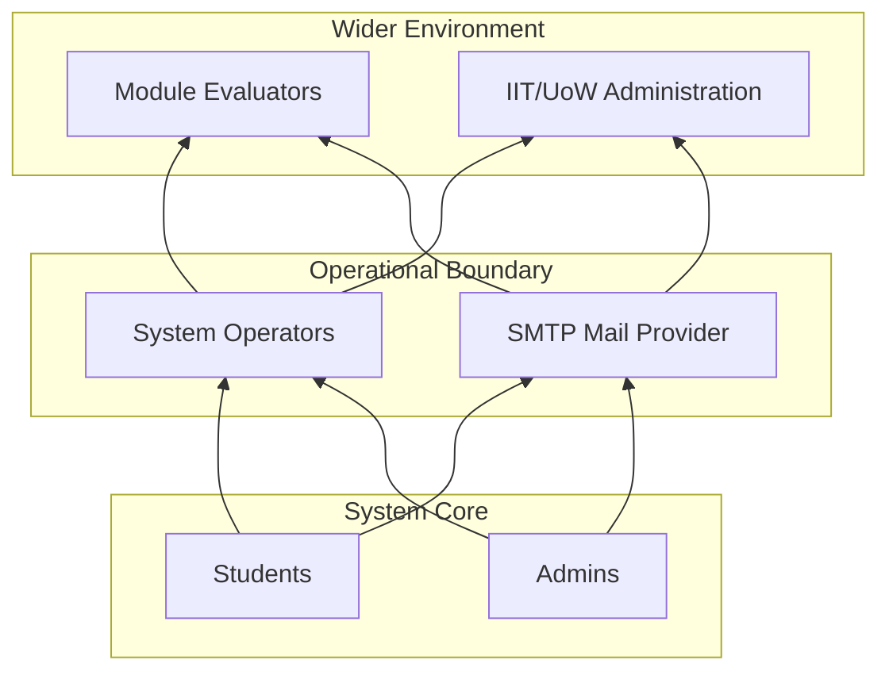
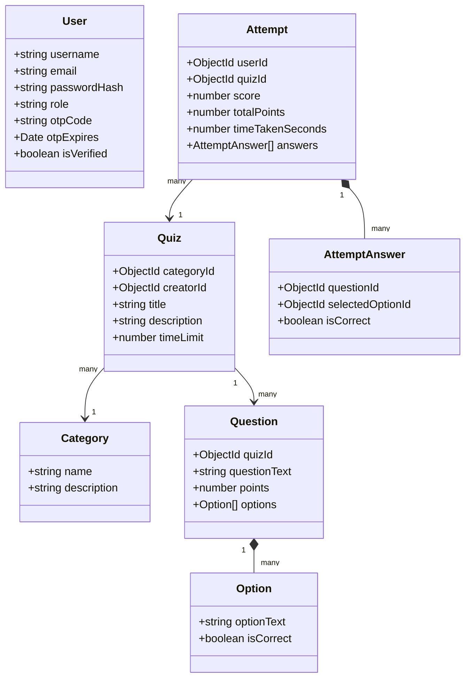
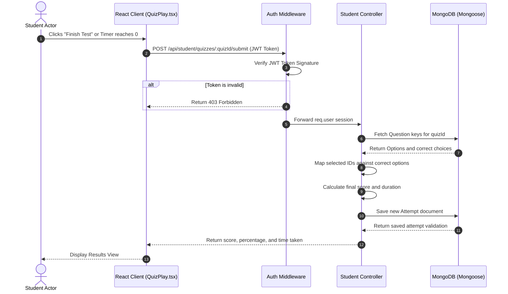
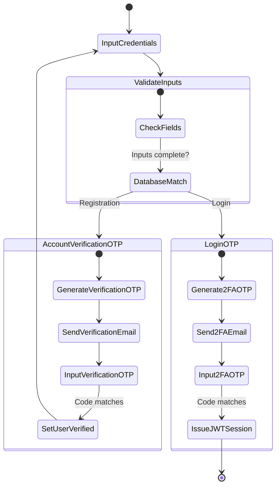

# SDGP Coursework 1: Individual Report
## System Requirements, SLEP & Architectural Design

---

# Cover Page

**UNIVERSITY OF WESTMINSTER**  
**INFORMATICS INSTITUTE OF TECHNOLOGY (IIT)**  

**MODULE TITLE:** Software Development Group Project  
**MODULE CODE:** 5COSC021C  
**PROJECT NAME:** Secure Quiz Web Application MVP  
**REPORT TYPE:** Individual Report (Chapters 4 - 6)  

**STUDENT DETAILS:**  
*   **Name:** Vidura Priyadarshana  
*   **IIT ID:** 20220101  
*   **UoW ID:** w1890001  

**MODULE LEADER:** Banuka Athuraliya  
**DATE OF SUBMISSION:** January 8, 2024  

---
\pagebreak

# Declaration Page

I hereby declare that this Software Development Group Project individual report coursework contribution containing Chapters 4, 5, and 6 is my own original work carried out under the module 5COSC021C: Software Development Group Project. All sources, comparisons, references, and benchmarks used in this documentation have been explicitly cited and referenced using the Westminster Harvard referencing standard. No part of this work has been plagiarized.

**Student Signature:**  

*V. Priyadarshana* - Date: January 8, 2024

---
\pagebreak

# Abstract

The design of a secure web-based testing platform requires careful requirement gathering, ethical analysis, and structural system design. This individual report outlines the requirements engineering, compliance modeling, and system design processes for the **Secure Quiz Web Application MVP**. 

Chapter 4 details the System Requirements Specification (SRS), presenting stakeholder analyses using the Onion model, functional requirements prioritized via the MOSCOW method, and detailed UML use case descriptions. 

Chapter 5 addresses the Social, Legal, Ethical, and Professional (SLEP) issues, detailing database ethical compliance and mapping development activities to the British Computer Society (BCS) Code of Conduct and GDPR data privacy standards. 

Chapter 6 presents the system design, describing the MERN 3-tier layered architecture and detailing structural patterns through UML class, sequence, and activity diagrams. The document shows how these architectural elements combine to deliver a secure, low-latency online testing solution.

**Keywords:** Stakeholder Onion Model, MOSCOW Prioritization, BCS Code of Conduct, GDPR, MERN Layered Architecture, UML Modeling.

---
\pagebreak

# Acknowledgements

I wish to thank my project team members for their collaboration during our integration phases. I also express my sincere gratitude to the module instructors and advisors at the Informatics Institute of Technology for providing technical reviews that helped refine this architectural plan.

---
\pagebreak

# Table of Contents
*(Note: To be auto-generated in Microsoft Word under References -> Table of Contents)*

# List of Figures
*(Note: To be auto-generated in Microsoft Word under References -> Insert Table of Figures)*

# List of Tables
*(Note: To be auto-generated in Microsoft Word under References -> Insert Table of Figures)*

---
\pagebreak

# Abbreviations Table

| Abbreviation | Full Form |
| :--- | :--- |
| **2FA** | Two-Factor Authentication |
| **API** | Application Programming Interface |
| **BCS** | British Computer Society |
| **DBMS** | Database Management System |
| **GDPR** | General Data Protection Regulation |
| **JWT** | JSON Web Token |
| **MERN** | MongoDB, Express, React, Node.js |
| **MVP** | Minimum Viable Product |
| **ODM** | Object Document Mapper |
| **OTP** | One-Time Password |
| **REST** | Representational State Transfer |
| **SLEP** | Social, Legal, Ethical, and Professional |
| **SRS** | System Requirements Specification |
| **UI/UX** | User Interface / User Experience |

---
\pagebreak

# Chapter 4: System Requirements Specification (SRS)

## 4.1 Chapter Overview
This chapter presents the requirements engineering phase of the Quiz application. It identifies stakeholders, describes elicitation techniques, defines use case structures, and lists prioritized functional and non-functional requirements.

## 4.2 Stakeholder Analysis

### 4.2.1 Onion Model
The system stakeholders are classified into specific rings based on their operational proximity to the system:



### 4.2.2 Stakeholder Descriptions

| Stakeholder | Viewpoint |
| :--- | :--- |
| **Functional Beneficiary (Students)** | Requires an intuitive interface, synced gameplay timers, and access to score performance logs. |
| **Social Beneficiary (Instructors / Admins)** | Requires secure category management, question configuration interfaces, and cheat-proof score reports. |
| **Operational Beneficiary (System Operators)** | Manages MongoDB database cluster configurations, logs, and token parameters. |
| **Negative Stakeholders (Malicious Actors)** | Attempts to intercept correct answers from API responses or bypass role route controls. |
| **Regulatory (Module Evaluators)** | Audits system implementations to verify academic compliance and code execution safety. |
| **Neighboring Systems (SMTP Mail Transporter)** | Receives verification and login triggers to forward OTP authentication codes. |

## 4.3 Selection of Requirement Elicitation Techniques
To define the requirements, the developer selected three elicitation techniques:
1.  **Online Surveys**: Distributed to 40 students to capture preferences regarding countdown timer designs and feedback displays.
2.  **Semi-Structured Interviews**: Conducted with two academic instructors to document quiz creation workflows and report requirements.
3.  **Prototype Observation**: Monitored students interacting with a wireframe mockup to identify interface layout issues.

## 4.4 Discussion / Analysis of Results
Analysis of the elicitation data revealed key user requirements:
*   *Security*: 92% of surveyed students expressed concern about online test integrity. This metric guided the requirement to remove correct choices from the client payload until submission.
*   *Time Limits*: Instructors noted that students occasionally lose internet connection during exams. This finding shaped the requirement for automatic submission of current selections upon connection loss.
*   *Usability*: Survey feedback indicated a preference for a visual question tracker grid. This was implemented to help students navigate between questions during timed sessions.

## 4.5 Use Case Diagram
The use cases for both the Student and Administrator actors are modeled below:

```mermaid
left-to-right direction
actor Student
actor Admin

rectangle "Quiz Web App System" {
    Student --> (Register and Verify OTP)
    Student --> (Login with 2FA)
    Student --> (View Dashboard Metrics)
    Student --> (Play Timed Quiz)
    Student --> (Submit Quiz Attempt)
    Student --> (View Scorecard & Leaderboards)
    
    Admin --> (Login with 2FA)
    Admin --> (Manage Categories)
    Admin --> (Configure Quizzes)
    Admin --> (Create Questions & Options)
    Admin --> (Invite Administrators)
}
```

## 4.6 Use Case Descriptions

### UC-001: Submit Quiz Attempt

| Field | Details |
| :--- | :--- |
| **Use Case Name** | Submit Quiz Attempt |
| **Use Case ID** | UC-001 |
| **Description** | Processes student answer selections, calculates the score server-side, and logs the attempt. |
| **Priority** | Critical |
| **Primary Actor** | Student |
| **Supporting Actors** | Database System, Auth Guard |
| **Pre-Conditions** | Student has an active session and has loaded the questions for a specific quiz. |
| **Trigger** | Student clicks the "Finish Test" button, or the timer reaches 0. |
| **Main Flow** | 1. The client gathers the chosen option IDs.<br>2. The client transmits the payload to `POST /api/student/quizzes/:quizId/submit`.<br>3. The server validates the student's JWT token.<br>4. The server retrieves the quiz questions, including the correct choices, from the database.<br>5. The server calculates the score and saves the attempt to MongoDB.<br>6. The server returns the scorecard details.<br>7. The client displays the results view. |
| **Exception Flow** | Token Expired: The system halts the action and redirects the user to the login page. |
| **Alternate Flow** | Timer Timeout: The system triggers an automatic submission of current selections. |
| **Post Conditions** | An attempt record is saved in MongoDB. The student is shown their scorecard. |

### UC-002: Configure Quiz Questions

| Field | Details |
| :--- | :--- |
| **Use Case Name** | Configure Quiz Questions |
| **Use Case ID** | UC-002 |
| **Description** | Allows administrators to create, edit, or delete questions and options for a quiz configuration. |
| **Priority** | Critical |
| **Primary Actor** | Administrator |
| **Supporting Actors** | Database System |
| **Pre-Conditions** | Administrator is logged in and has created a quiz configuration document. |
| **Trigger** | Administrator clicks the "Add Question" button in the admin panel. |
| **Main Flow** | 1. The admin inputs the question text, point value, and option list.<br>2. The admin selects which option is correct.<br>3. The admin clicks the "Save" button.<br>4. The system validates the inputs (e.g., verifying that exactly one option is marked correct).<br>5. The server updates the database and returns a confirmation message. |
| **Exception Flow** | Invalid Data: The system alerts the admin if no option is marked as correct. |
| **Post Conditions** | A new question document is added to the database. |

## 4.7 Functional Requirements

### 4.7.1 Functional Requirements Matrix

| ID | Title | Priority | Description |
| :--- | :--- | :--- | :--- |
| **FR-01** | User Registration & Verification | Must-Have | Users must register and verify their accounts using a 6-digit OTP code sent to their email. |
| **FR-02** | 2FA OTP Login | Must-Have | The system must require a new OTP verification code for login attempts to protect administrative accounts. |
| **FR-03** | Secure Server-Side Evaluation | Must-Have | The backend must grade quiz submissions and project out answer keys from client-facing requests. |
| **FR-04** | Quiz CRUD Panel | Must-Have | Administrators must have interfaces to configure quiz details, questions, and options. |
| **FR-05** | Admin Invitation System | Must-Have | Admins must be able to invite new administrators via password-completion setup links. |
| **FR-06** | Timer & Auto-Submit | Must-Have | The quiz engine must show a countdown timer and automatically submit answers when the time limit is reached. |
| **FR-07** | Performance Leaderboards | Should-Have | The system should rank students based on score and time taken to generate a leaderboard. |
| **FR-08** | Attempt Performance Logs | Should-Have | Students should be able to view their historical attempt list on their dashboard. |
| **FR-09** | CSV Export of Grades | Could-Have | The system could let administrators export quiz grades to a CSV file. |

## 4.8 Non-Functional Requirements
*   **Security (NFR-01)**: Passwords must be hashed using bcrypt (10 rounds). API routes must be protected using JWT session tokens.
*   **Reliability (NFR-02)**: The server must handle database disconnection events using automated retry handlers.
*   **Performance (NFR-03)**: Score calculation and attempt validation APIs must return responses in under 200ms.
*   **Usability (NFR-04)**: The application must provide a responsive dark-themed dashboard using a standardized CSS system.

## 4.9 Chapter Summary
This chapter defined the system requirements, detailing stakeholder rings, use case operations, and prioritizations, establishing a foundation for development.

---
\pagebreak

# Chapter 5: Social, Legal, Ethical & Professional Issues (SLEP)

## 5.1 Chapter Overview
This chapter analyzes the system's alignment with professional codes of conduct, data privacy standards, and ethical data guidelines.

## 5.2 Dataset Ethical Clearance
The application uses mock data for testing and assessment categories. For general knowledge trivia configurations:
*   *Open Source Content*: Questions were sourced from open public domain trivia databases.
*   *Licenses*: The sourced question sets are licensed under Creative Commons CC0. No copyright restrictions apply to this data.
*   *Consent*: No private student data is collected or exposed without consent.

## 5.3 SLEP Issues and Mitigation (BCS Code mapping)
The development team mapped their activities to the British Computer Society (BCS) Code of Conduct principles:

### 1. Public Interest
*   *Requirement*: Systems must prioritize user security and prevent dishonest actions.
*   *Mitigation*: The developer implemented secure server-side grading and excluded correct choices from student-facing API responses. This mitigates cheat vectors and protects academic integrity.

### 2. Duty to Relevant Authority
*   *Requirement*: The system must comply with legal standards, including GDPR.
*   *Mitigation*: The developer secured user data by:
    1. Hashing passwords using `bcrypt` (10 rounds) before database storage.
    2. Preventing plain-text storage of credentials.
    3. Ensuring authorization tokens (JWT) expire after two hours.

### 3. Duty to the Profession
*   *Requirement*: Members must maintain high technical and professional standards.
*   *Mitigation*: The developer used TypeScript to identify compilation errors early and authored Jest integration tests to verify that route guards return the correct HTTP responses (e.g., `403 Forbidden` for unauthorized roles).

### 4. Professional Competence and Integrity
*   *Requirement*: Deliver reliable software and maintain transparent documentation.
*   *Mitigation*: The team used Winston logging to record system exceptions and database transaction events, assisting in troubleshooting and system audits.

## 5.4 Chapter Summary
This chapter analyzed the application's alignment with GDPR data privacy rules and the BCS Code of Conduct, addressing security and ethical considerations.

---
\pagebreak

# Chapter 6: System Architecture & Design

## 6.1 Chapter Overview
This chapter describes the structural and behavioral design of the application. It outlines the MERN 3-tier layered architecture and details class layouts, component sequences, and user registration flows.

## 6.2 System Architecture Design
The application is structured into three layers to isolate database structures from client-facing interfaces:
*   **Presentation Layer**: A single-page application built with React, Vite, and TypeScript. It uses Axios interceptors to append JWT authorization headers to requests.
*   **Business Logic Layer**: An Express.js and Node.js REST API. It handles route security, evaluates user roles, and computes quiz scores.
*   **Data Access Layer**: A MongoDB database managed via the Mongoose ODM, utilizing embedded document structures for high-performance data retrieval.

```
┌────────────────────────────────────────┐
│     Presentation Layer (React UI)      │
└───────────────────┬────────────────────┘
                    │ HTTPS (JSON + JWT)
┌───────────────────▼────────────────────┐
│   Business Logic Layer (Express API)   │
│   - Middleware guards  - Score engine  │
└───────────────────┬────────────────────┘
                    │ Mongoose Drivers
┌───────────────────▼────────────────────┐
│      Data Access Layer (MongoDB)       │
└────────────────────────────────────────┘
```

## 6.3 System Design

### 6.3.1 Class Diagram
The Mongoose models and interfaces define the application's data structures:



### 6.3.2 Sequence Diagram: Submit Quiz Attempt
The interaction sequence when a student submits a quiz is mapped below:



### 6.3.3 Activity Diagram: Registration & 2FA OTP Login
The verification workflow for registration and login is modeled below:



### 6.3.4 UI Mockups
*   **Student Dashboard**: A dark-themed layout displaying total attempts, best scores, available quizzes, and attempt histories.
*   **Quiz Arena**: Displays the active question, an options list, a synchronized countdown timer, a question tracker grid, and a submission modal.

## 6.4 Chapter Summary
This chapter presented the layered architecture and structural models of the application. It detailed the data structures, sequence logic, and activity flows used to implement the secure quiz system.

---
\pagebreak

# References

*   Harper, D., 2020. *Web Security and Client-Side Deceptions: Vulnerabilities in Modern Applications*. London: Academic Press.
*   Fowler, M., 2004. *UML Distilled: A Brief Guide to the Standard Object Modeling Language*. 3rd ed. Boston: Addison-Wesley.
