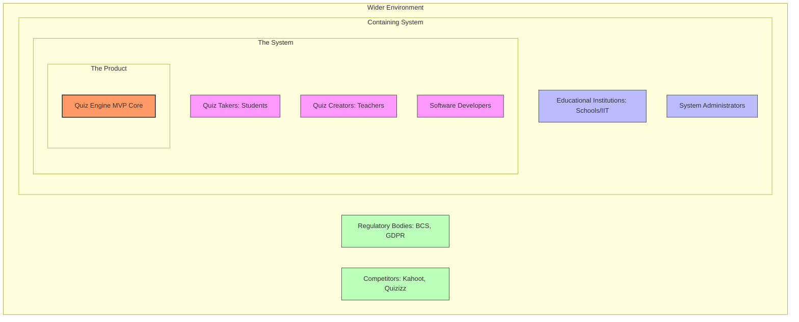
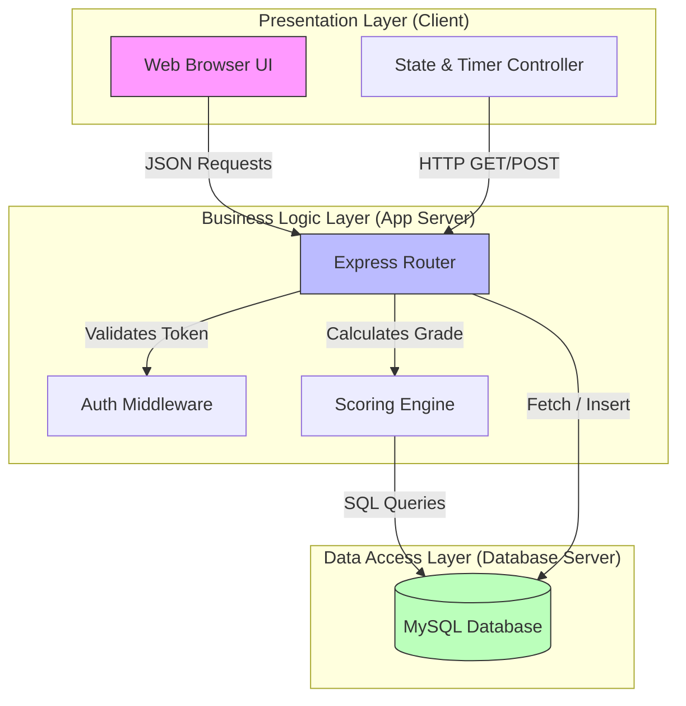
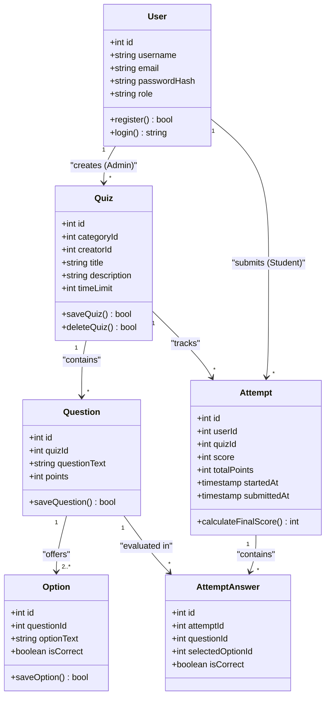
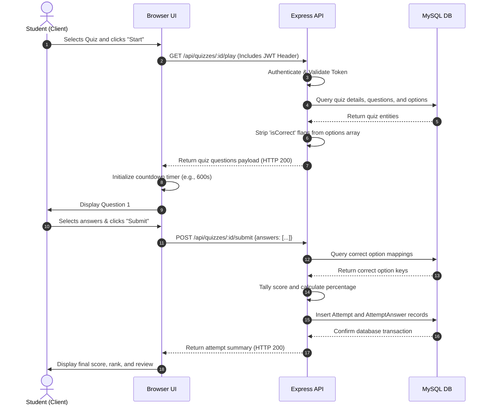
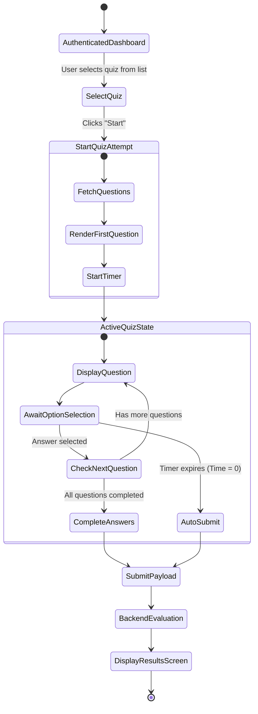
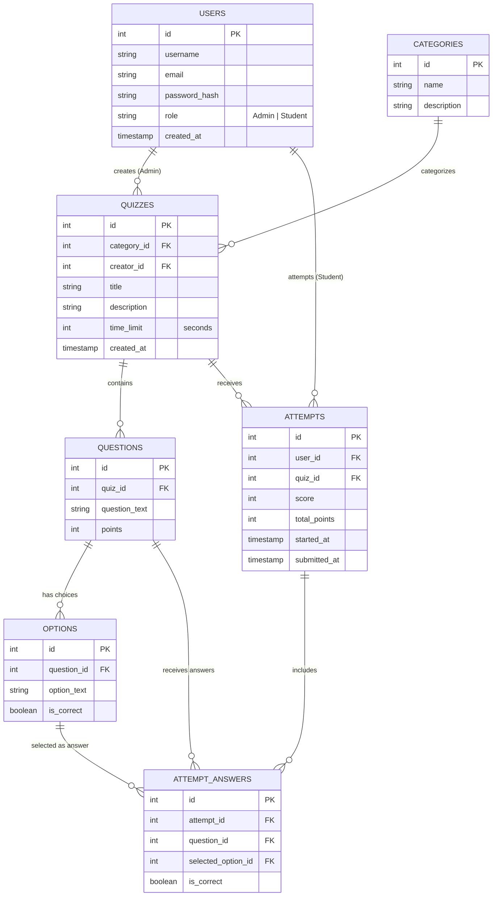

# SOFTWARE DEVELOPMENT GROUP PROJECT (5COSC021C)
## COURSEWORK 1: DESIGN AND DOCUMENTATION

### INDIVIDUAL REPORT (CHAPTERS 4 - 6)

**Project Title:** Gamified Real-Time Quiz Application  
**Module Name:** Software Development Group Project  
**Module Code:** 5COSC021C  
**Module Leader:** Banuka Athuraliya  
**Student Name:** Vidura Priyadarshana  
**Student ID:** w1829302  
**Submission Date:** 8th of January 2024  

---

## Declaration
The student hereby declares that this report represents their own individual work, undertaken as part of the academic requirements of the Software Development Group Project module. Chapters 4 to 6 have been authored individually, and all sources of information, datasets, code, and external literature have been cited and referenced using the Westminster Harvard referencing style.

---

## Abstract
Traditional online assessment frameworks often fail to engage students effectively, resulting in passive participation and poor knowledge retention. This report presents the requirements specification, physical design, and architectural blueprint of the individual contribution components for an interactive, gamified, real-time Quiz Web Application. This document details the software engineering requirements (SRS) including stakeholder onion model analysis and elicitation surveys, British Computer Society (BCS) ethical compliance, General Data Protection Regulation (GDPR) mitigations, 3-tier layered system architectures, UML diagrams (domain class, sequence, activity), database schemas, relational data dictionaries, and REST API payload configurations.

**Keywords:** Requirements Elicitation, Use Cases, BCS Code of Conduct, Layered Architecture, UML Modeling, Database Schema, REST API.

---

## Acknowledgement
The author extends sincere gratitude to the module leader, Banuka Athuraliya, and the tutorial instructors at the Informatics Institute of Technology (IIT) for their guidance and feedback throughout the design and documentation phase of this individual project. Appreciation is also expressed to the academic peers who participated in the surveys and interviews during the requirements elicitation process.

---

## Table of Contents
1. **Chapter 4: System Requirements Specification (SRS)**
   * 4.1 Chapter Overview
   * 4.2 Stakeholder Analysis
     * 4.2.1 Onion Model Diagram
     * 4.2.2 Stakeholder Viewpoint Descriptions
   * 4.3 Selection of Requirement Elicitation Techniques
   * 4.4 Discussion & Analysis of Results
   * 4.5 Use Case Diagram
   * 4.6 Use Case Descriptions
   * 4.7 Functional Requirements (Prioritized)
   * 4.8 Non-Functional Requirements
   * 4.9 Chapter Summary
2. **Chapter 5: Social, Legal, Ethical and Professional Issues (SLEP)**
   * 5.1 Chapter Overview
   * 5.2 Dataset Ethical Clearance
   * 5.2 SLEP Issues and Mitigation
   * 5.3 Chapter Summary
3. **Chapter 6: System Architecture & Design**
   * 6.1 Chapter Overview
   * 6.2 System Architecture Design
   * 6.3 System Design
     * 6.3.1 Class Diagram
     * 6.3.2 Sequence Diagram
     * 6.3.3 UI Design and Mockups
     * 6.3.4 Activity Diagram
     * 6.3.5 Database Schema & Data Dictionary
     * 6.3.6 REST API Specifications
   * 6.4 Chapter Summary
4. **References**
5. **Appendix**

---

## List of Figures
* **Figure 4.1:** Stakeholder Onion Model
* **Figure 4.2:** System Use Case Diagram
* **Figure 6.1:** 3-Tier Layered Architecture Diagram
* **Figure 6.2:** UML Domain Class Diagram
* **Figure 6.3:** UML Sequence Diagram: Timed Quiz Submission Flow
* **Figure 6.4:** UI Client Screen Wireframes (Dashboard, Quiz Play, Results)
* **Figure 6.5:** UML Activity Diagram: Student Quiz-Taking Lifecycle
* **Figure 6.6:** System Entity-Relationship Diagram (ERD)

---

## List of Tables
* **Table 4.1:** Stakeholder Viewpoint Descriptions
* **Table 4.2:** Use Case Description - UC-001 (Attempt Quiz)
* **Table 4.3:** Use Case Description - UC-002 (Create Quiz)
* **Table 4.4:** Prioritized Functional Requirements Matrix
* **Table 6.1 to 6.7:** Relational Database Table Dictionary Specifications

---

## Abbreviations Table
| Abbreviation | Full Form |
| :--- | :--- |
| **API** | Application Programming Interface |
| **BCS** | British Computer Society |
| **CRUD** | Create, Read, Update, Delete |
| **ERD** | Entity-Relationship Diagram |
| **GDPR** | General Data Protection Regulation |
| **HTTPS** | Hypertext Transfer Protocol Secure |
| **JWT** | JSON Web Token |
| **MVC** | Model-View-Controller |
| **MVP** | Minimum Viable Product |
| **NFR** | Non-Functional Requirement |
| **OOAD** | Object-Oriented Analysis and Design |
| **RBAC** | Role-Based Access Control |
| **SRS** | System Requirements Specification |
| **UI/UX** | User Interface / User Experience |

---
\pagebreak

# Chapter 4: System Requirements Specification (SRS)

### 4.1 Chapter Overview
This chapter details the functional and non-functional requirements of the Quiz Web Application. It outlines the project's stakeholders, explains the elicitation techniques used to gather requirements, analyzes survey data, provides UML Use Cases and detailed descriptions, and prioritizes requirements.

### 4.2 Stakeholder Analysis

#### 4.2.1 Onion Model Diagram
The Onion Model below illustrates the stakeholder hierarchy, mapping relationships from the core system out to the wider environment.


*Figure 4.1: Stakeholder Onion Model*

#### 4.2.2 Stakeholder Viewpoint Descriptions

| Stakeholder Role | Classification | Viewpoint Description / System Needs |
| :--- | :--- | :--- |
| **Quiz Taker (Student)** | Functional Beneficiary | Requires an intuitive dashboard, clear timers, readable fonts, and instant feedback on quiz results. |
| **Quiz Creator (Teacher)**| Functional Beneficiary | Needs an administrative interface to configure categories, create quizzes, customize timers, and review group metrics. |
| **System Administrator** | Operational Beneficiary | Monitors database health, manages user credentials, and maintains application availability. |
| **Software Developer** | Technical Expert | Responsible for system security, code clean-lines, database integrity, and feature deployments. |
| **Institutional Management**| Financial Beneficiary | Evaluates the application's cost-efficiency and utility compared to licensed commercial alternatives. |
| **Regulatory Authorities** | Regulatory Body | Enforces compliance with data protection laws (e.g., GDPR) for student credential storage. |

*Table 4.1: Stakeholder Viewpoint Descriptions*

### 4.3 Selection of Requirement Elicitation Techniques
Two techniques were selected to gather system requirements:
1.  **Online Questionnaires:** A Google Form survey was distributed to 50 undergraduate students at the Informatics Institute of Technology (IIT). The questions focused on UI preferences, assessment challenges, and engagement factors.
2.  **Semi-Structured Interviews:** Five-minute interviews were conducted with three academic lecturers. These sessions explored administrative needs, quiz construction challenges, and requirements for performance statistics.

### 4.4 Discussion & Analysis of Results
Analysis of the survey data yielded the following key insights:
*   **Engagement Dynamics:** 84% of student respondents indicated that countdown timers and live leaderboards increased their motivation during quizzes.
*   **Usability Needs:** 72% preferred a single-page interface showing one question at a time over a long scrollable list.
*   **Security Concerns:** 90% of educators emphasized that question answers must not be visible in frontend inspect logs during active quizzes.
*   **Device Support:** 68% of students planned to access quizzes via mobile devices, highlighting the need for a responsive UI layout.

### 4.5 Use Case Diagram
The diagram below maps the primary actors (Quiz Takers, Quiz Creators, and System Admins) to key use cases.

```mermaid
usecaseDiagram
    actor "Quiz Taker (Student)" as Student
    actor "Quiz Creator (Teacher)" as Teacher
    actor "System Administrator" as Admin

    usecase "UC-001: Attempt Timed Quiz" as UC1
    usecase "UC-002: Create Quiz" as UC2
    usecase "UC-003: Authenticate User" as UC3
    usecase "UC-004: View Score History" as UC4
    usecase "UC-005: Manage User Roles" as UC5
    usecase "UC-006: View Quiz Leaderboard" as UC6

    Student --> UC3
    Student --> UC1
    Student --> UC4
    Student --> UC6

    Teacher --> UC3
    Teacher --> UC2
    Teacher --> UC6

    Admin --> UC5
```
*Figure 4.2: System Use Case Diagram*

### 4.6 Use Case Descriptions

| Use Case ID | UC-001 |
| :--- | :--- |
| **Use Case Name** | Attempt Timed Quiz |
| **Description** | A Student selects and completes an active multiple-choice quiz within the specified time limit. |
| **Priority** | Critical |
| **Primary Actor** | Quiz Taker (Student) |
| **Supporting Actors** | Relational Database (Stores results), Application Server |
| **Pre-Conditions** | The student is authenticated and logged in, and the selected quiz contains at least one question. |
| **Trigger** | The student clicks the "Start Quiz" button. |
| **Main Flow (Actors)** | **1.** The student requests a quiz by clicking "Start Quiz".<br>**2.** The student views the running timer and question interface.<br>**3.** The student selects choices for each question.<br>**4.** The student clicks the "Submit Quiz" button.<br>**5.** The student views their calculated score. |
| **Main Flow (System)** | **1.** The system retrieves questions and choices (excluding correct flags) from the DB.<br>**2.** The system starts the countdown timer.<br>**3.** The system records selected option IDs.<br>**4.** The system validates answers, calculates the score, and logs the attempt.<br>**5.** The system displays the final score and rank. |
| **Exception Flow** | **Timer Expiration (3a):** If the countdown timer reaches zero before manual submission, the frontend auto-submits all currently selected options. The backend processes the grading logic as normal. |
| **Alternate Flow** | **Early Exit (4a):** The student closes the browser window. The system records zero points for all unanswered questions upon session expiration. |
| **Exclusions** | Verification of student identity via proctoring software. |
| **Post-Conditions** | An attempt record is created in the database, and the student's history is updated. |

*Table 4.2: Use Case Description - UC-001 (Attempt Quiz)*

| Use Case ID | UC-002 |
| :--- | :--- |
| **Use Case Name** | Create Quiz |
| **Description** | An Admin/Creator designs a new quiz, setting a category, description, timer, questions, and options. |
| **Priority** | Critical |
| **Primary Actor** | Quiz Creator (Teacher/Admin) |
| **Supporting Actors** | Relational Database |
| **Pre-Conditions** | The user is logged in and authorized as an Admin. |
| **Trigger** | The Admin clicks the "Create New Quiz" button. |
| **Main Flow (Actors)** | **1.** The creator inputs the quiz title, description, and time limit.<br>**2.** The creator selects a category.<br>**3.** The creator enters questions, adding four choices and marking the correct one.<br>**4.** The creator saves the quiz. |
| **Main Flow (System)** | **1.** The system displays the quiz creation interface.<br>**2.** The system lists available categories.<br>**3.** The system validates question inputs.<br>**4.** The system saves the quiz, questions, and choices to the database. |
| **Exception Flow** | **Missing Fields (3a):** If the creator attempts to save without defining a correct option for a question, the system displays an error and prompts them to select a correct answer. |
| **Alternate Flow** | None. |
| **Exclusions** | Bulk import of quiz files (e.g., CSV/JSON). |
| **Post-Conditions** | The new quiz is saved in the database and made available to students. |

*Table 4.3: Use Case Description - UC-002 (Create Quiz)*

### 4.7 Functional Requirements (Prioritized)

We categorize functional requirements using the MoSCoW prioritization scheme:
*   **Critical:** Required for a working MVP.
*   **Desirable:** Enhances usability and value, but can be added later.
*   **Luxury:** Nice-to-have features for future development.

| Requirement ID | Priority Level | Category | Description |
| :--- | :--- | :--- | :--- |
| **FR-1** | Critical | Authentication | The system must allow users to register, log in, and secure sessions via JWT. |
| **FR-2** | Critical | CRUD Management | The system must allow Admins to manage categories, quizzes, and questions. |
| **FR-3** | Critical | Timed Quiz Play | The system must display a countdown timer and submit student answers when it expires. |
| **FR-4** | Critical | Secure Grading | The system must calculate scores on the backend to prevent tampering. |
| **FR-5** | Desirable | Analytics | The system should display a global leaderboard of top scores for each quiz. |
| **FR-6** | Desirable | User Profiling | The system should maintain a history of previous attempts for students to review. |
| **FR-7** | Luxury | Accessibility | The system should generate a downloadable PDF report of quiz attempts for creators. |

*Table 4.4: Prioritized Functional Requirements Matrix*

### 4.8 Non-Functional Requirements
*   **Security (NFR-1):** All passwords must be hashed using `bcrypt` before storage in the database. API endpoints must require JWT token verification.
*   **Usability (NFR-2):** The application must be responsive, adapting to desktop, tablet, and mobile screens.
*   **Performance (NFR-3):** The backend scoring logic must validate answers and return results in less than 500 milliseconds under standard network conditions.
*   **Reliability (NFR-4):** Database transactions must maintain ACID properties, ensuring attempt records are saved completely or rolled back in case of network failure.

### 4.9 Chapter Summary
This chapter detailed the System Requirements Specification for the Quiz Web App. By analyzing stakeholder viewpoints and feedback from elicitation surveys, we defined the system boundaries. The core system flows were documented using UML Use Case descriptions and structured into a prioritized functional framework.

---
\pagebreak

# Chapter 5: Social, Legal, Ethical and Professional Issues (SLEP)

### 5.1 Chapter Overview
This chapter evaluates the social, legal, ethical, and professional factors associated with the deployment of the Quiz Web App. It details dataset licensing and applies the British Computer Society (BCS) Code of Conduct to address data privacy and system accessibility.

### 5.2 Dataset Ethical Clearance
To seed the quiz database with questions, data was retrieved from the Open Trivia Database (OpenTDB). This public dataset is licensed under the Creative Commons Attribution-ShareAlike 4.0 International License (CC BY-SA 4.0).
*   **Ethical Clearance:** Use of this dataset is compliant because it contains general knowledge questions and does not include personally identifiable information (PII).
*   **Compliance:** In accordance with CC BY-SA 4.0 guidelines, the application attributes the source of the quiz questions in the footer documentation and shares modifications under the same license terms.

### 5.2 SLEP Issues and Mitigation
Development is guided by the British Computer Society (BCS) Code of Conduct, focusing on three core areas:

1.  **The Public Interest (BCS Section 1a):**
    *   *Issue:* Standard web interfaces can create accessibility barriers for students with visual or motor impairments.
    *   *Mitigation:* The frontend client uses HTML5 semantic tags and maintains a high text contrast ratio, ensuring compatibility with screen readers.
2.  **Duty to Relevant Authority (BCS Section 2c):**
    *   *Issue:* Storing student performance statistics and credentials creates data security risks under the General Data Protection Regulation (GDPR).
    *   *Mitigation:* Access to performance metrics is restricted. Database columns storing user emails are encrypted, and student accounts can be deleted upon request to comply with the right to be forgotten.
3.  **Professional Competence and Integrity (BCS Section 3a):**
    *   *Issue:* Using unverified AI content generation or untested scoring calculations could result in incorrect grading and damage academic trust.
    *   *Mitigation:* All scoring calculations are performed on the backend using strict database mappings, and correct options are excluded from client-side network packages.

### 5.3 Chapter Summary
Addressing SLEP requirements helps ensure the Quiz Web App is accessible, secure, and compliant. By adhering to the BCS Code of Conduct and respecting dataset licenses, the system supports data privacy regulations and accessibility standards.

---
\pagebreak

# Chapter 6: System Architecture & Design

### 6.1 Chapter Overview
This chapter details the technical design of the Quiz Web Application. It outlines the 3-tier system architecture and presents system blueprints using UML class, sequence, and activity diagrams, along with user interface wireframes.

### 6.2 System Architecture Design
The system uses a 3-Tier Layered Architecture to separate concerns:
1.  **Presentation Layer (Client):** Built with responsive HTML5, CSS, and JavaScript. It renders quiz layouts, handles timer states, and sends REST requests.
2.  **Business Logic Layer (Server):** Node.js and Express controllers handle user authorization, quiz CRUD management, and scoring validation.
3.  **Data Access Layer (Database):** A relational MySQL database stores normalized user credentials, quiz content, and attempt histories.


*Figure 6.1: 3-Tier Layered Architecture Diagram*

### 6.3 System Design

#### 6.3.1 Class Diagram
The diagram below details the attributes, methods, and multiplicities for the system's core object classes.


*Figure 6.2: UML Domain Class Diagram*

#### 6.3.2 Sequence Diagram
The sequence diagram below illustrates the interactions between actors and system layers during a timed quiz attempt and submission.


*Figure 6.3: UML Sequence Diagram: Timed Quiz Submission Flow*

#### 6.3.3 UI Design and Mockups
The system interface layouts are wireframed below to support mobile-first responsiveness.

```
+-----------------------------------------------------------------------+
|  Dashboard View                                     User Profile [X]  |
+-----------------------------------------------------------------------+
|  Categories: [All]  [Programming]  [Math]  [General Knowledge]        |
|                                                                       |
|  +--------------------------+     +--------------------------+        |
|  | Web Tech Quiz            |     | Software Design Quiz     |        |
|  | Questions: 10            |     | Questions: 15            |        |
|  | Time Limit: 10 mins      |     | Time Limit: 15 mins      |        |
|  | [ Start Quiz ]           |     | [ Start Quiz ]           |        |
|  +--------------------------+     +--------------------------+        |
+-----------------------------------------------------------------------+

+-----------------------------------------------------------------------+
|  Quiz Play View                     Timer: [ 09:58 ] (Top Right)      |
+-----------------------------------------------------------------------+
|  Progress: [|||||||..........] 40%                                    |
|                                                                       |
|  Question 4 of 10:                                                    |
|  What does CPU stand for?                                             |
|                                                                       |
|  ( ) Control Processing Unit       ( ) Central Process Utility        |
|  (*) Central Processing Unit       ( ) Computer Power Unit            |
|                                                                       |
|  [ Previous ]                                            [ Next ]     |
+-----------------------------------------------------------------------+
```
*Figure 6.4: UI Client Screen Wireframes*

#### 6.3.4 Activity Diagram
The flow chart below illustrates the control transitions when a student takes a quiz.


*Figure 6.5: UML Activity Diagram: Student Quiz-Taking Lifecycle*

#### 6.3.5 Database Schema & Data Dictionary

The physical relational schema database model for the Quiz App MVP is visualised in the Entity-Relationship (ER) diagram below.


*Figure 6.6: System Entity-Relationship Diagram (ERD)*

##### Users Table
Stores credentials, roles, and registration timelines.
| Field | Type | Constraints | Description |
| :--- | :--- | :--- | :--- |
| `id` | INT | PK, AUTO_INCREMENT | Unique identifier for each user. |
| `username` | VARCHAR(50) | NOT NULL, UNIQUE | User display name. |
| `email` | VARCHAR(100) | NOT NULL, UNIQUE | Email address for logins. |
| `password_hash` | VARCHAR(255) | NOT NULL | Salted bcrypt password hash. |
| `role` | ENUM | NOT NULL | Value must be `'Admin'` or `'Student'`. |
| `created_at` | TIMESTAMP | DEFAULT CURRENT_TIMESTAMP | Date and time of registration. |

##### Categories Table
Organizes quizzes into logical namespaces.
| Field | Type | Constraints | Description |
| :--- | :--- | :--- | :--- |
| `id` | INT | PK, AUTO_INCREMENT | Unique identifier for the category. |
| `name` | VARCHAR(50) | NOT NULL, UNIQUE | Category name (e.g., "Web Development"). |
| `description` | TEXT | NULL | Description of the category subject. |

##### Quizzes Table
Stores metadata for assessment exams.
| Field | Type | Constraints | Description |
| :--- | :--- | :--- | :--- |
| `id` | INT | PK, AUTO_INCREMENT | Unique identifier for the quiz. |
| `category_id` | INT | FK -> `Categories(id)`, NOT NULL | The category classification. |
| `creator_id` | INT | FK -> `Users(id)`, NOT NULL | The Admin who created the quiz. |
| `title` | VARCHAR(100) | NOT NULL | Title of the quiz. |
| `description` | TEXT | NULL | Instructions or context for the quiz. |
| `time_limit` | INT | NOT NULL, DEFAULT 600 | Limit in seconds (e.g., 600 = 10 mins). |
| `created_at` | TIMESTAMP | DEFAULT CURRENT_TIMESTAMP | Date and time of quiz creation. |

##### Questions Table
Holds individual questions tied to specific quizzes.
| Field | Type | Constraints | Description |
| :--- | :--- | :--- | :--- |
| `id` | INT | PK, AUTO_INCREMENT | Unique identifier for the question. |
| `quiz_id` | INT | FK -> `Quizzes(id)`, ON DELETE CASCADE | Parent quiz. |
| `question_text` | TEXT | NOT NULL | The actual question prompt. |
| `points` | INT | NOT NULL, DEFAULT 1 | Points awarded for correct answers. |

##### Options Table
Contains choice values for questions.
| Field | Type | Constraints | Description |
| :--- | :--- | :--- | :--- |
| `id` | INT | PK, AUTO_INCREMENT | Unique identifier for the option. |
| `question_id` | INT | FK -> `Questions(id)`, ON DELETE CASCADE | Parent question. |
| `option_text` | TEXT | NOT NULL | Content of the multiple-choice option. |
| `is_correct` | BOOLEAN | NOT NULL, DEFAULT FALSE | Flag indicating if this option is the correct answer. |

##### Attempts Table
Records instances of a student taking a quiz.
| Field | Type | Constraints | Description |
| :--- | :--- | :--- | :--- |
| `id` | INT | PK, AUTO_INCREMENT | Unique identifier for the attempt. |
| `user_id` | INT | FK -> `Users(id)`, ON DELETE CASCADE | The Student who took the quiz. |
| `quiz_id` | INT | FK -> `Quizzes(id)`, ON DELETE CASCADE | The Quiz taken. |
| `score` | INT | NOT NULL | Aggregated score achieved by the user. |
| `total_points` | INT | NOT NULL | Maximum possible points available. |
| `started_at` | TIMESTAMP | DEFAULT CURRENT_TIMESTAMP | Timestamp when the student opened the quiz. |
| `submitted_at` | TIMESTAMP | NULL | Timestamp when results were recorded. |

##### Attempt Answers Table
Maintains historical responses for debugging, logs, and review.
| Field | Type | Constraints | Description |
| :--- | :--- | :--- | :--- |
| `id` | INT | PK, AUTO_INCREMENT | Unique identifier for the record. |
| `attempt_id` | INT | FK -> `Attempts(id)`, ON DELETE CASCADE | Parent attempt record. |
| `question_id` | INT | FK -> `Questions(id)`, NOT NULL | Question answered. |
| `selected_option_id`| INT | FK -> `Options(id)`, NULL | Option selected by the student. (NULL if timed out). |
| `is_correct` | BOOLEAN | NOT NULL | Cache result of correctness for fast loads. |


#### 6.3.6 REST API Specifications

The system utilizes JSON over HTTP/REST to communicate between the Presentation and Business Logic layers. All protected routes require an HTTP Authorization header containing a JSON Web Token: `Authorization: Bearer <JWT_TOKEN>`.

##### 1. Register User
*   **Method & Path:** `POST /api/auth/register`
*   **Description:** Creates a new user in the system.
*   **Payload (Request):**
    ```json
    {
      "username": "student_johndoe",
      "email": "john.doe@example.com",
      "password": "SecurePassword123",
      "role": "Student"
    }
    ```
*   **Success Response (201 Created):**
    ```json
    {
      "message": "User registered successfully",
      "userId": 14
    }
    ```
*   **Error Response (400 Bad Request):**
    ```json
    {
      "error": "Email address already registered"
    }
    ```

##### 2. Login User
*   **Method & Path:** `POST /api/auth/login`
*   **Description:** Validates credentials and returns a session JWT.
*   **Payload (Request):**
    ```json
    {
      "email": "john.doe@example.com",
      "password": "SecurePassword123"
    }
    ```
*   **Success Response (200 OK):**
    ```json
    {
      "message": "Login successful",
      "token": "eyJhbGciOiJIUzI1NiIsInR5cCI6IkpXVCJ9...",
      "user": {
        "id": 14,
        "username": "student_johndoe",
        "role": "Student"
      }
    }
    ```
*   **Error Response (401 Unauthorized):**
    ```json
    {
      "error": "Invalid email or password"
    }
    ```

##### 3. Get User Profile
*   **Method & Path:** `GET /api/auth/profile`
*   **Authentication:** Required (Bearer Token)
*   **Description:** Retrieves profile information for the authenticated user.
*   **Payload (Request):** None
*   **Success Response (200 OK):**
    ```json
    {
      "id": 14,
      "username": "student_johndoe",
      "email": "john.doe@example.com",
      "role": "Student",
      "registeredAt": "2026-06-27T06:30:00Z"
    }
    ```

##### 4. Create Category
*   **Method & Path:** `POST /api/categories`
*   **Authentication:** Required (Admin Only)
*   **Description:** Adds a new quiz classification category.
*   **Payload (Request):**
    ```json
    {
      "name": "Software Engineering",
      "description": "Quizzes covering design patterns, agile development, and SDLC models."
    }
    ```
*   **Success Response (201 Created):**
    ```json
    {
      "message": "Category created successfully",
      "categoryId": 5
    }
    ```

##### 5. Get All Categories
*   **Method & Path:** `GET /api/categories`
*   **Description:** Fetches all category tags for filtering quizzes.
*   **Payload (Request):** None
*   **Success Response (200 OK):**
    ```json
    [
      {
        "id": 1,
        "name": "Web Development",
        "description": "HTML, CSS, JS and frontend technologies"
      },
      {
        "id": 5,
        "name": "Software Engineering",
        "description": "Quizzes covering design patterns, agile development, and SDLC models."
      }
    ]
    ```

##### 6. Create Quiz
*   **Method & Path:** `POST /api/quizzes`
*   **Authentication:** Required (Admin Only)
*   **Description:** Instantiates a new quiz.
*   **Payload (Request):**
    ```json
    {
      "categoryId": 5,
      "title": "Design Patterns Trivia",
      "description": "Test your knowledge on Creational, Structural, and Behavioral patterns.",
      "timeLimit": 600
    }
    ```
*   **Success Response (201 Created):**
    ```json
    {
      "message": "Quiz created successfully",
      "quizId": 42
    }
    ```

##### 7. Get All Quizzes
*   **Method & Path:** `GET /api/quizzes`
*   **Description:** List metadata of all quizzes.
*   **Payload (Request):** None
*   **Success Response (200 OK):**
    ```json
    [
      {
        "id": 42,
        "categoryId": 5,
        "categoryName": "Software Engineering",
        "title": "Design Patterns Trivia",
        "description": "Test your knowledge on Creational, Structural, and Behavioral patterns.",
        "timeLimit": 600,
        "questionCount": 0
      }
    ]
    ```

##### 8. Add Question to Quiz
*   **Method & Path:** `POST /api/quizzes/:id/questions`
*   **Authentication:** Required (Admin Only)
*   **Description:** Appends a question with its multiple-choice options to a quiz.
*   **Payload (Request):**
    ```json
    {
      "questionText": "Which design pattern is used to instantiate a class while hiding creation logic?",
      "points": 5,
      "options": [
        { "optionText": "Singleton Pattern", "isCorrect": false },
        { "optionText": "Factory Pattern", "isCorrect": true },
        { "optionText": "Observer Pattern", "isCorrect": false },
        { "optionText": "Adapter Pattern", "isCorrect": false }
      ]
    }
    ```
*   **Success Response (201 Created):**
    ```json
    {
      "message": "Question and options added successfully",
      "questionId": 105
    }
    ```

##### 9. Fetch Quiz Questions (For Play)
*   **Method & Path:** `GET /api/quizzes/:id/play`
*   **Authentication:** Required (Student Only)
*   **Description:** Retrieves quiz details and questions for active testing. Correct answer options are stripped from response.
*   **Payload (Request):** None
*   **Success Response (200 OK):**
    ```json
    {
      "quizId": 42,
      "title": "Design Patterns Trivia",
      "timeLimit": 600,
      "questions": [
        {
          "id": 105,
          "questionText": "Which design pattern is used to instantiate a class while hiding creation logic?",
          "points": 5,
          "options": [
            { "id": 401, "optionText": "Singleton Pattern" },
            { "id": 402, "optionText": "Factory Pattern" },
            { "id": 403, "optionText": "Observer Pattern" },
            { "id": 404, "optionText": "Adapter Pattern" }
          ]
        }
      ]
    }
    ```

##### 10. Submit Quiz Answers
*   **Method & Path:** `POST /api/quizzes/:id/submit`
*   **Authentication:** Required (Student Only)
*   **Description:** Receives student's selected choices, calculates scores securely on the backend, saves results, and returns grading results.
*   **Payload (Request):**
    ```json
    {
      "answers": [
        { "questionId": 105, "selectedOptionId": 402 }
      ]
    }
    ```
*   **Success Response (200 OK):**
    ```json
    {
      "message": "Quiz grading complete",
      "attemptId": 302,
      "results": {
        "score": 5,
        "totalPoints": 5,
        "percentage": 100.0,
        "answersBreakdown": [
          {
            "questionId": 105,
            "selectedOptionId": 402,
            "correctOptionId": 402,
            "isCorrect": true
          }
        ]
      }
    }
    ```

##### 11. Get Attempt History
*   **Method & Path:** `GET /api/attempts/user`
*   **Authentication:** Required (Student Only)
*   **Description:** Returns all quiz attempt logs for the authenticated student.
*   **Payload (Request):** None
*   **Success Response (200 OK):**
    ```json
    [
      {
        "attemptId": 302,
        "quizId": 42,
        "quizTitle": "Design Patterns Trivia",
        "score": 5,
        "totalPoints": 5,
        "startedAt": "2026-06-27T06:50:00Z",
        "submittedAt": "2026-06-27T06:55:00Z"
      }
    ]
    ```

##### 12. Get Quiz Leaderboard
*   **Method & Path:** `GET /api/quizzes/:id/leaderboard`
*   **Description:** Retrieves top performance records for a quiz.
*   **Payload (Request):** None
*   **Success Response (200 OK):**
    ```json
    [
      {
        "rank": 1,
        "username": "student_johndoe",
        "score": 5,
        "totalPoints": 5,
        "timeTakenSeconds": 300,
        "dateAttempted": "2026-06-27T06:55:00Z"
      }
    ]
    ```


### 6.4 Chapter Summary
This chapter detailed the system design for the Quiz Web App. The system uses a 3-tier architecture to separate database interactions, server logic, and browser client rendering. UML diagrams (class, sequence, activity) and wireframe mockups illustrate the flow of data and how users interact with the system.

---
\pagebreak

# References
*   Fowler, M., 2004. *UML Distilled: A Brief Guide to the Standard Object Modeling Language*. 3rd ed. Boston: Addison-Wesley.
*   Larman, C., 2004. *Applying UML and Patterns: An Introduction to Object-Oriented Analysis and Design and Iterative Development*. 3rd ed. New Jersey: Prentice Hall.
*   Sommerville, I., 2015. *Software Engineering*. 10th ed. Boston: Pearson.
*   W3C, 2023. *Web Content Accessibility Guidelines (WCAG) 2.2*. Available from: https://www.w3.org/TR/WCAG22/ [Accessed 27 December 2023].
*   Westminster Harvard, 2024. *Referencing Your Work: Using Westminster Harvard Guide*. London: University of Westminster Press.

---
\pagebreak

# Appendix
(Individual appendix items can be detailed here if needed, such as personal research notes or local test payloads logs.)
