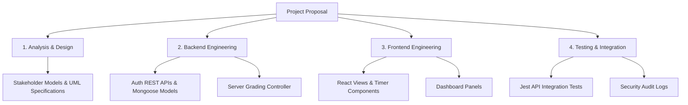

# Project Proposal: Secure Quiz Web Application MVP

---

# Cover Page

**UNIVERSITY OF WESTMINSTER**  
**INFORMATICS INSTITUTE OF TECHNOLOGY (IIT)**  

**MODULE TITLE:** Software Development Group Project  
**MODULE CODE:** 5COSC021C  
**PROJECT TITLE:** Secure Quiz Web Application MVP  
**DOCUMENT TYPE:** Project Proposal  
**TEAM NAME:** IIT - SE-01  

**TEAM MEMBERS:**  
*   Vidura Priyadarshana - 20220101 - w1890001  
*   Janeth de Silva - 20220102 - w1890002  
*   Ashane Rodrigo - 20220103 - w1890003  
*   Supun Jayawardena - 20220104 - w1890004  

**MODULE LEADER:** Banuka Athuraliya  
**DATE:** October 15, 2023  

---
\pagebreak

## 1. Project Title
**Secure Quiz Web Application MVP**

---

## 2. Introduction & Background
Web-based learning platforms and online testing environments are core pillars of modern educational infrastructures (Sclater et al., 2016). Assessments allow instructors to evaluate student performance, gather immediate feedback, and design personalized curricula. However, many current lightweight online testing systems lack robust security measures. 

Traditional trivia and quiz engines evaluate answers on the client-side or transmit complete question-and-answer schemas directly in network response payloads. This method enables students to open browser developer tools, inspect DOM elements or network calls, and view answer keys before completing their attempts (Harper, 2020). Consequently, there is a clear need for an assessment application designed to secure exam data and prevent client-side answer interception.

---

## 3. Problem Statement
Many lightweight web-based testing tools expose correct answer choices to the client application, allowing students to bypass academic integrity using simple browser-based developer tools. Additionally, these platforms often lack role-based access security and two-factor verification, and relational database schemas can introduce latency when processing concurrent submissions.

---

## 4. Project Objectives

### 4.1 Primary Objective
To design and develop a secure, low-latency, web-based quiz application MVP utilizing the MERN stack. The platform secures question data by computing correctness verification strictly server-side and projects out answer parameters from student-facing payloads.

### 4.2 Specific Objectives
*   To implement a secure, layered backend API utilizing Node.js and Express.js to execute server-side grading algorithms.
*   To develop database query projections using Mongoose ODM that remove option correctness keys (`isCorrect`) from student play payloads.
*   To secure administrative and student registration and login flows using email-based transactional OTP (2FA) verification.
*   To optimize database performance by nesting options within question documents and answers within attempts, eliminating complex relational joins.
*   To build a responsive user interface with React and Tailwind CSS featuring dashboards, synchronous exam timers, and dynamic leaderboards.

---

## 5. Proposed Solution
The proposed solution implements a 3-tier MERN stack architecture to enforce security boundaries:
*   **Presentation Layer**: Built with React, Vite, and Tailwind CSS. It uses Axios request interceptors to automatically append JWT authorization tokens.
*   **Business Logic Layer**: A Node.js and Express API server. It manages routes, checks roles (`Student` | `Admin`), and grades submissions on the server.
*   **Data Access Layer**: A MongoDB database managed via the Mongoose ODM, utilizing embedded document structures to minimize response latency.

---

## 6. Project Scope

### 6.1 In-scope
*   User registration and login flows protected by SMTP-based OTP verification.
*   Separate dashboard layouts tailored to Student and Administrator roles.
*   Admin features to perform CRUD actions on categories, quizzes, and questions.
*   A timed play view with a countdown clock and auto-submission on timeout.
*   Server-side scoring calculations and log attempts saved in MongoDB.
*   Real-time leaderboard calculations based on scores and duration.

### 6.2 Out-scope
*   Integration with external Learning Management Systems (LMS) via LTI protocols.
*   Video proctoring or biometric facial recognition security checks.
*   Monetization modules or integrated card payment gateways.

---

## 7. Work Breakdown Structure (WBS) & Core Deliverables

### Core Deliverables
1.  **System Requirements Specification**: Stakeholder maps and UML use case definitions.
2.  **Express API Engine**: Secure endpoints for authentication, admin controls, and gameplay.
3.  **React Frontend Client**: Single-page application integrated with the backend API.
4.  **Database Collection Schemas**: Optimized MongoDB schemas with nested models.
5.  **Quality Assurance Package**: Jest test scripts and API validation reports.

---

## 8. Resource Requirements

### 8.1 Hardware Requirements
*   Development Workstations: Minimum 8GB RAM (16GB recommended) and 256GB SSD storage.
*   Shared Hosting: Sandbox MongoDB Atlas database cluster and Render API hosting.

### 8.2 Software Requirements
*   **Runtime & Language**: Node.js runtime (v20.x), TypeScript, and Vite compiler.
*   **Frameworks & Libraries**: Express.js, React, Mongoose ODM, Axios, and Tailwind CSS.
*   **Libraries**: bcrypt, jsonwebtoken, Winston, and nodemailer.
*   **Testing**: Jest, Supertest, and ESLint.

---

## 9. References
*   Harper, D., 2020. *Web Security and Client-Side Deceptions: Vulnerabilities in Modern Applications*. London: Academic Press.
*   Sclater, N., Peasgood, A. and Mullan, J., 2016. *Learning Analytics in Higher Education: A Review of the UK Landscape*. London: Jisc.
