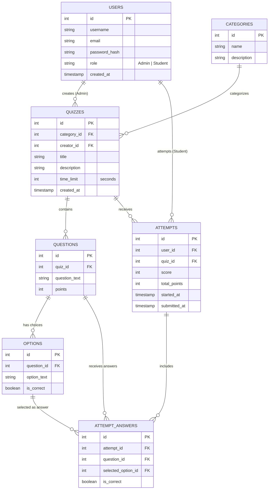

# Quiz Web App MVP: Features & ER Diagram Specification

This document provides a detailed explanation of the features and database design for the 2-day Quiz Web App MVP. The design satisfies the requirements of the coursework.

---

## 1. Feature Specifications & Explanations

The Quiz Web App MVP is divided into two primary user portals (Admin/Creator and Student/Taker) supported by a shared authentication layer and an automated scoring engine.

### A. Authentication & User Management (Shared)
*   **Role-Based Access Control (RBAC):** Users register and login. The database maps each user to either an `Admin` (Quiz Creator) or a `Student` (Quiz Taker) role. 
*   **Token-Based Session Management:** Secure login generates a JSON Web Token (JWT) containing the user’s ID and role. This token is passed in the header of subsequent requests to authenticate and authorize actions.

### B. Admin Portal (Quiz Creator)
*   **Category Management:** Admins can group quizzes into distinct categories (e.g., *Programming*, *Mathematics*, *History*) to simplify student browsing.
*   **Quiz CRUD:** Admins can create, view, update, and delete quizzes. Each quiz defines a title, description, category, and an overall time limit (in seconds).
*   **Question Builder:** Within a quiz, admins can add multiple-choice questions. Each question holds:
    *   A question prompt (text).
    *   Points (grading weights).
    *   Four multiple-choice options, with exactly one marked as correct.

### C. Student Portal (Quiz Taker)
*   **Quiz Dashboard:** Students browse active quizzes filtered by categories.
*   **Interactive Timed Quiz Interface:** When a student starts a quiz, the system loads the questions (hiding which options are correct) and triggers a client-side timer matched to the quiz's `time_limit`.
*   **Immediate Scoring Engine:** Upon quiz submission (or timer expiration), the backend evaluates the student's selected options against the database's correct options, calculates the total score, and commits the attempt record to the database.
*   **History & Leaderboards:** Students view a history of their past quiz attempts, showing their score, percentage, and completion time. A global leaderboard displays the top-performing students for each quiz.

---

## 2. Entity-Relationship (ER) Diagram

Below is the database schema for the Quiz App MVP. It ensures normalized relations to prevent data redundancy and support analytical history.

---

## 3. Database Data Dictionary

### Users Table
Stores credentials, roles, and registration timelines.
| Field | Type | Constraints | Description |
| :--- | :--- | :--- | :--- |
| `id` | INT | PK, AUTO_INCREMENT | Unique identifier for each user. |
| `username` | VARCHAR(50) | NOT NULL, UNIQUE | User display name. |
| `email` | VARCHAR(100) | NOT NULL, UNIQUE | Email address for logins. |
| `password_hash` | VARCHAR(255) | NOT NULL | Salted bcrypt password hash. |
| `role` | ENUM | NOT NULL | Value must be `'Admin'` or `'Student'`. |
| `created_at` | TIMESTAMP | DEFAULT CURRENT_TIMESTAMP | Date and time of registration. |

### Categories Table
Organizes quizzes into logical namespaces.
| Field | Type | Constraints | Description |
| :--- | :--- | :--- | :--- |
| `id` | INT | PK, AUTO_INCREMENT | Unique identifier for the category. |
| `name` | VARCHAR(50) | NOT NULL, UNIQUE | Category name (e.g., "Web Development"). |
| `description` | TEXT | NULL | Description of the category subject. |

### Quizzes Table
Stores metadata for assessment exams.
| Field | Type | Constraints | Description |
| :--- | :--- | :--- | :--- |
| `id` | INT | PK, AUTO_INCREMENT | Unique identifier for the quiz. |
| `category_id` | INT | FK -> `Categories(id)`, NOT NULL | The category classification. |
| `creator_id` | INT | FK -> `Users(id)`, NOT NULL | The Admin who created the quiz. |
| `title` | VARCHAR(100) | NOT NULL | Title of the quiz. |
| `description` | TEXT | NULL | Instructions or context for the quiz. |
| `time_limit` | INT | NOT NULL, DEFAULT 600 | Limit in seconds (e.g., 600 = 10 mins). |
| `created_at` | TIMESTAMP | DEFAULT CURRENT_TIMESTAMP | Date and time of quiz creation. |

### Questions Table
Holds individual questions tied to specific quizzes.
| Field | Type | Constraints | Description |
| :--- | :--- | :--- | :--- |
| `id` | INT | PK, AUTO_INCREMENT | Unique identifier for the question. |
| `quiz_id` | INT | FK -> `Quizzes(id)`, ON DELETE CASCADE | Parent quiz. |
| `question_text` | TEXT | NOT NULL | The actual question prompt. |
| `points` | INT | NOT NULL, DEFAULT 1 | Points awarded for correct answers. |

### Options Table
Contains choice values for questions.
| Field | Type | Constraints | Description |
| :--- | :--- | :--- | :--- |
| `id` | INT | PK, AUTO_INCREMENT | Unique identifier for the option. |
| `question_id` | INT | FK -> `Questions(id)`, ON DELETE CASCADE | Parent question. |
| `option_text` | TEXT | NOT NULL | Content of the multiple-choice option. |
| `is_correct` | BOOLEAN | NOT NULL, DEFAULT FALSE | Flag indicating if this option is the correct answer. |

### Attempts Table
Records instances of a student taking a quiz.
| Field | Type | Constraints | Description |
| :--- | :--- | :--- | :--- |
| `id` | INT | PK, AUTO_INCREMENT | Unique identifier for the attempt. |
| `user_id` | INT | FK -> `Users(id)`, ON DELETE CASCADE | The Student who took the quiz. |
| `quiz_id` | INT | FK -> `Quizzes(id)`, ON DELETE CASCADE | The Quiz taken. |
| `score` | INT | NOT NULL | Aggregated score achieved by the user. |
| `total_points` | INT | NOT NULL | Maximum possible points available. |
| `started_at` | TIMESTAMP | DEFAULT CURRENT_TIMESTAMP | Timestamp when the student opened the quiz. |
| `submitted_at` | TIMESTAMP | NULL | Timestamp when results were recorded. |

### Attempt Answers Table
Maintains historical responses for debugging, logs, and review.
| Field | Type | Constraints | Description |
| :--- | :--- | :--- | :--- |
| `id` | INT | PK, AUTO_INCREMENT | Unique identifier for the record. |
| `attempt_id` | INT | FK -> `Attempts(id)`, ON DELETE CASCADE | Parent attempt record. |
| `question_id` | INT | FK -> `Questions(id)`, NOT NULL | Question answered. |
| `selected_option_id`| INT | FK -> `Options(id)`, NULL | Option selected by the student. (NULL if timed out). |
| `is_correct` | BOOLEAN | NOT NULL | Cache result of correctness for fast loads. |
