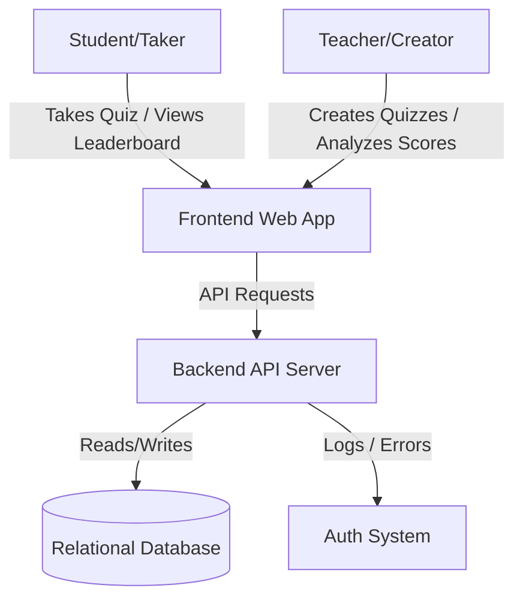
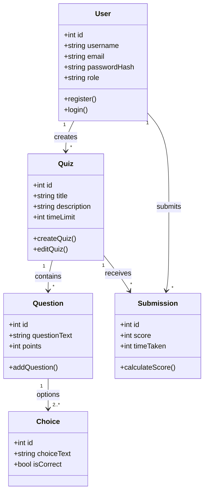
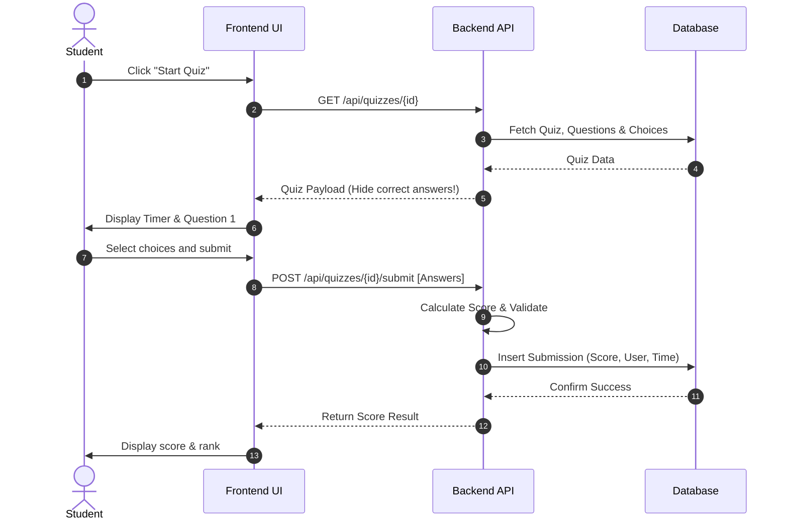
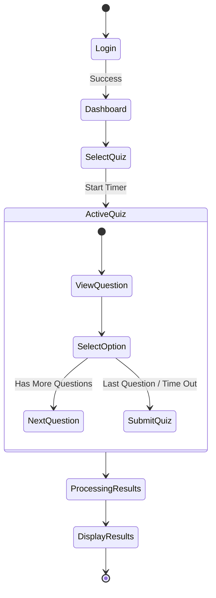

# Quiz Web App: SDGP Coursework 1 Implementation Guide

This guide provides a comprehensive checklist and design blueprint to implement a **Quiz Web App** and complete all documentation requirements outlined in the [SDGP CW 1 Guidelines](file:///d:/IIT%20Project/SDGP%20CW%201%20-%20Design%20and%20Documentation%20Template%20and%20Guidelines.docx.pdf).

---

## 1. Technical Deliverables (The Code to Build)
To support the architectural diagrams, use cases, and requirements described in your reports, you should implement a functional prototype with the following components:

### A. Core Features (Minimum Viable Product - MVP)
*   **User Management:**
    *   Registration, Login, and Role-Based Access Control (RBAC) separating **Quiz Creators** (e.g., Teachers/Admins) and **Quiz Takers** (e.g., Students).
*   **Quiz Creation & Management (Creator Portal):**
    *   Create, Read, Update, and Delete (CRUD) quizzes.
    *   Add multiple-choice questions with answers, score weightings, and custom time limits.
*   **Quiz Play Experience (Taker Portal):**
    *   Browse available quizzes.
    *   A timed, interactive test interface with clean visual feedback.
    *   Instant grading upon submission.
*   **Leaderboards & Analytics:**
    *   Scoreboard showing top performers.
    *   Individual user profile showing progress and history.

### B. Database Schema (SQL/NoSQL)
A solid relational structure to back your diagrams (Class Diagram / Sequence Diagram):
*   `Users` Table: `id`, `username`, `email`, `password_hash`, `role` (Creator/Taker), `created_at`
*   `Quizzes` Table: `id`, `title`, `description`, `creator_id` (FK to Users), `time_limit` (seconds), `created_at`
*   `Questions` Table: `id`, `quiz_id` (FK to Quizzes), `question_text`, `points`, `order`
*   `Choices` Table: `id`, `question_id` (FK to Questions), `choice_text`, `is_correct` (boolean)
*   `Submissions` Table: `id`, `user_id` (FK to Users), `quiz_id` (FK to Quizzes), `score`, `time_taken` (seconds), `submitted_at`

### C. Recommended Tech Stack
*   **Frontend:** HTML5, CSS3 (Vanilla/Tailwind), Javascript (Vite / React or Next.js for a modern dynamic feel).
*   **Backend:** Node.js with Express (JavaScript) or Python (Flask/FastAPI) to handle authentication, scoring logic, and database operations.
*   **Database:** PostgreSQL/MySQL (relational structures translate directly into UML Class Diagrams).

---

## 2. Group Report Deliverables (Chapters 1–3)
The Group Report focuses on the problem background, existing landscape, and project management.

### Chapter 1: Introduction
You must establish the justification for building this Quiz Web App.
*   **1.2 Problem Background:** Analyze the lack of engaging, user-friendly remote learning assessments. Highlight issues like high attrition rates in online education, exam anxiety, and the lack of instant analytics for instructors.
*   **1.3 Problem Statement:** 
    > *"Traditional online assessment tools lack real-time engagement and immediate analytical feedback, leading to low student participation and administrative overhead for educators."*
*   **1.4 Proposed Solution:** Describe a gamified, real-time Quiz Web App with instant grading, an interactive leaderboard, and an intuitive quiz creator.
*   **1.7 Project Scope:**
    *   *In-Scope:* User registration/login, multiple-choice quiz creation, timed quiz-taking UI, automated grading, leaderboard.
    *   *Out-of-Scope:* Advanced anti-cheat integrations (like eye-tracking), complex essay/short-answer auto-grading, offline support.
*   **1.8 Rich Picture Diagram:** A diagram mapping out users, instructors, database servers, web client, and reporting services.



*   **1.12 Business Model Canvas:** Map out Key Partners (educational institutions, cloud providers), Key Activities (web dev, maintenance), Value Propositions (interactive, painless quiz creation), Customer Relationships (self-service, feedback forms), Customer Segments (schools, remote trainers, students), and Revenue Streams (premium subscriptions, ad-supported tier).

---

### Chapter 2: Existing Work
Benchmarking the app against competitors.
*   **2.2 Existing Work:** Compare your Quiz Web App with popular platforms:
    *   *Kahoot:* Highly gamified, great for sync play but lacks detailed asynchronous assessment features.
    *   *Quizizz:* Good for asynchronous play, but pricing can be restrictive.
    *   *Google Forms:* Easy to create quizzes, but lacks engagement, gamification, and robust leaderboards.
*   **Benchmarking Table:** Compare features (Time-limits, Leaderboards, Question Types, Analytics, Ease of Use) across these platforms.

---

### Chapter 3: Methodology
The operational structure of your team.
*   **3.3 Development Methodology:** Choose **Agile (Scrum)**. Justify it because it allows iterative refinement of the Quiz UI and API endpoints over 2-week sprints.
*   **3.4 Design Methodology:** **Object-Oriented Analysis and Design (OOAD)** (fits perfectly with UML and MVC architectures).
*   **3.6 Work Breakdown Structure (WBS):**
    *   *Member A:* UI/UX Design, HTML/CSS Frontend Development.
    *   *Member B:* Backend API development (Express/Python), JWT Authentication.
    *   *Member C:* Database architecture, Query optimization, Deployment.
    *   *Member D:* Testing, QA, Documentation, Elicitation Analysis.
*   **3.8 PM & Collaboration Evidence:** Trello boards showing "To Do", "In Progress", and "Done" columns for Quiz App features. Meeting logs showing weekly syncs.
*   **3.9 Risks and Mitigation:**
    *   *Risk 1:* SQL Injection in quiz answers (Severity 5, Frequency 2 -> Sanitize input, use parameterized queries).
    *   *Risk 2:* Network lag during active quiz-taking (Severity 4, Frequency 4 -> Optimize payloads, client-side timers).

---

## 3. Individual Report Deliverables (Chapters 4–6)
The Individual Report focuses on software engineering diagrams and design.

### Chapter 4: System Requirements Specification (SRS)
*   **4.2.1 Stakeholder Onion Model:**
    *   *The Product:* The Quiz Web App Engine.
    *   *The System:* Students, Teachers, Database, Auth system.
    *   *Containing System:* Schools, Universities, Online academies.
    *   *Wider Environment:* Competitors (Kahoot), Regulatory bodies (GDPR/Data Privacy laws).
*   **4.5 Use Case Diagram:**

```mermaid
usecaseDiagram
    actor "Quiz Taker" as taker
    actor "Quiz Creator" as creator
    actor "System Admin" as admin

    usecase "Register & Login" as UC1
    usecase "Browse Quizzes" as UC2
    usecase "Take Quiz (Timed)" as UC3
    usecase "View Leaderboard" as UC4
    usecase "Create Quiz" as UC5
    usecase "Manage Users" as UC6

    taker --> UC1
    taker --> UC2
    taker --> UC3
    taker --> UC4

    creator --> UC1
    creator --> UC5
    creator --> UC4

    admin --> UC6
```

*   **4.7 Functional Requirements (FRs):**
    *   `FR1 [Critical]`: The system shall allow users to register and log in securely.
    *   `FR2 [Critical]`: The system shall support timed quiz gameplay.
    *   `FR3 [Desirable]`: The system shall display real-time global leaderboards for each quiz.
    *   `FR4 [Luxury]`: The system shall generate a PDF report of performance for Creators.

---

### Chapter 5: Social, Legal, Ethical and Professional Issues (SLEP)
*   **5.2 Dataset Ethical Clearance:** If using pre-existing quiz questions from online public datasets (e.g., Open Trivia DB), detail the license (CC BY-SA 4.0) and attribute it properly.
*   **5.2 SLEP Issues & BCS Code of Conduct:**
    *   *Public Interest (BCS 1a):* Ensuring quiz content is accessible (supporting screen-readers).
    *   *Professional Competence (BCS 2c):* Security of user passwords (using bcrypt hashing, preventing leaks of personal emails).
    *   *Data Privacy (GDPR/PDPA):* Informing students of what performance data is collected and allowing profile deletion.

---

### Chapter 6: System Architecture & Design
*   **6.2 System Architecture Design:** 3-Tier Layered Architecture (Presentation Layer, Business Logic Layer, Data Access Layer).
*   **6.3.1 Class Diagram:**



*   **6.3.2 Sequence Diagram (Take Quiz):**



*   **6.3.3 UI Wireframes/Mockups:** Sketch out 3 screens:
    1.  *Dashboard:* Showing available quizzes and recent activities.
    2.  *Quiz-Taking Interface:* A layout with a progress bar, timer at the top right, centered question card, and 4 option buttons at the bottom.
    3.  *Score Review:* Big score card, "Try Again" or "View Leaderboard" buttons, and question breakdown indicating correct/incorrect responses.
*   **6.3.4 Activity Diagram (Quiz Lifecycle):**


