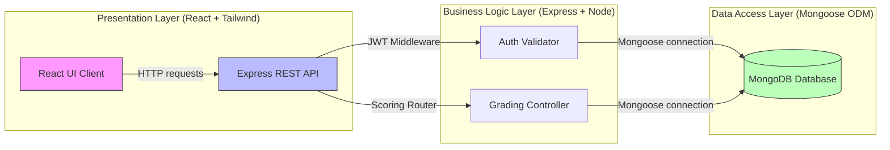
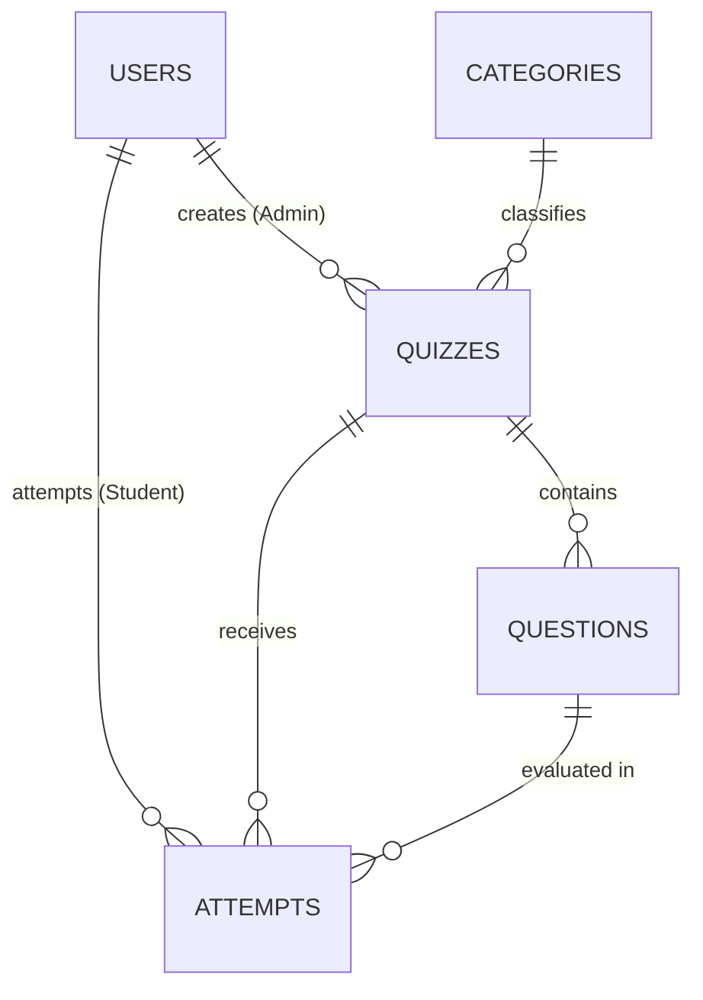

# Quiz Web App MVP: MERN Stack Unified Technical Implementation Plan

This document serves as the single source of truth for the technical design, system architectures, folder structures, configuration variables, API schemas, and coursework implementation guidelines for the **Quiz Web App MVP** utilizing the **MERN Stack** (MongoDB, Express, React, Node.js) with **Mongoose ODM** and **Tailwind CSS**.

---

## 1. System Architecture (MERN 3-Tier Layered)

The application separates operations into three decoupled layers:
*   **Presentation Layer (Client):** A single-page application (SPA) built with **React**, configured using **Vite**, written in **TypeScript**, and styled with **Tailwind CSS**. It communicates with the backend REST server asynchronously via **Axios** client requests (utilising request interceptors for automated JWT authorization header attachment), maintains visual states, and executes the client-side gameplay countdown timer.
*   **Business Logic Layer (API Server):** A RESTful API engine powered by **Node.js** and **Express**. It handles API routing, validates session JWTs via middleware guards, and processes grading logic securely server-side.
*   **Data Access Layer (Database):** A document-based **MongoDB** database. Schemas and collections are defined and managed through the **Mongoose ODM** for clean validation, casting, and model operations.



---

## 2. Project Folder Structure (Monorepo Layout)

```
quiz-app-mern/
│
├── backend/                        # Node.js + Express API Server
│   ├── src/
│   │   ├── config/
│   │   │   └── db.ts               # MongoDB Mongoose connection
│   │   ├── models/                 # Mongoose schema definitions
│   │   │   ├── User.ts
│   │   │   ├── Category.ts
│   │   │   ├── Quiz.ts
│   │   │   ├── Question.ts
│   │   │   └── Attempt.ts
│   │   ├── controllers/
│   │   │   ├── auth.controller.ts  # Sign-up, Sign-in, Profile
│   │   │   ├── quiz.controller.ts  # Admin CRUD for quizzes & categories
│   │   │   └── play.controller.ts  # Timed quiz play and secure grading
│   │   ├── middleware/
│   │   │   └── auth.middleware.ts  # JWT validation & Admin/Student guard
│   │   ├── routes/
│   │   │   ├── auth.routes.ts
│   │   │   ├── quiz.routes.ts
│   │   │   └── play.routes.ts
│   │   ├── types/
│   │   │   └── index.ts            # Custom Express session type overrides
│   │   └── app.ts                  # App instantiation & server startup
│   ├── .env                        # Database URI and JWT secret
│   ├── package.json
│   └── tsconfig.json
│
├── frontend/                       # React + Vite Client
│   ├── public/
│   ├── src/
│   │   ├── components/             # Shared layout and timer components
│   │   │   ├── ui/                 # Shadcn UI primitives (automatically managed)
│   │   │   │   ├── button.tsx
│   │   │   │   ├── card.tsx
│   │   │   │   ├── progress.tsx
│   │   │   │   └── alert.tsx
│   │   │   ├── Navbar.tsx
│   │   │   └── Timer.tsx
│   │   ├── context/
│   │   │   └── AuthContext.tsx     # Session Auth state provider
│   │   ├── pages/                  # Page layouts styled with Tailwind
│   │   │   ├── Dashboard.tsx
│   │   │   ├── Login.tsx
│   │   │   ├── QuizPlay.tsx        # Gameplay arena card
│   │   │   ├── Results.tsx         # User performance & leaderboards
│   │   │   └── Register.tsx
│   │   ├── utils/
│   │   │   └── api.ts              # Fetch/axios configurations
│   │   ├── App.tsx                 # Screen routes, guards and layouts
│   │   ├── index.css               # Tailwind CSS directives
│   │   └── main.tsx
│   ├── .env                        # VITE_API_BASE_URL variable
│   ├── index.html
│   ├── package.json
│   ├── tailwind.config.js          # Tailwind styling rules
│   ├── tsconfig.json
│   └── vite.config.ts
```

---

## 3. MongoDB Schema & Mongoose Data Dictionary

To leverage MongoDB's non-relational document model, we **embed** subdocuments where appropriate (such as choices/options inside questions, and answers inside attempts) instead of splitting them into separate SQL-style tables. This reduces the need for slow relational joins (`$lookup`) and ensures high-performance retrieval.

### A. Database Entity Relationships (Logical Model)



### B. Mongoose Document Specifications

#### 1. User Model (`users` collection)
Stores credentials, roles, and registration timestamps.
```typescript
const UserSchema = new Schema({
  username: { type: String, required: true, unique: true, trim: true },
  email: { type: String, required: true, unique: true, lowercase: true, trim: true },
  passwordHash: { type: String, required: true },
  role: { type: String, enum: ['Admin', 'Student'], required: true },
  createdAt: { type: Date, default: Date.now }
});
```

#### 2. Category Model (`categories` collection)
Classifies quizzes into subjects.
```typescript
const CategorySchema = new Schema({
  name: { type: String, required: true, unique: true, trim: true },
  description: { type: String, required: true }
});
```

#### 3. Quiz Model (`quizzes` collection)
Holds metadata configuration for exams.
```typescript
const QuizSchema = new Schema({
  categoryId: { type: Schema.Types.ObjectId, ref: 'Category', required: true },
  creatorId: { type: Schema.Types.ObjectId, ref: 'User', required: true },
  title: { type: String, required: true, trim: true },
  description: { type: String },
  timeLimit: { type: Number, required: true, default: 600 }, // in seconds
  createdAt: { type: Date, default: Date.now }
});
```

#### 4. Question Model (`questions` collection)
Holds individual questions. Options/Choices are **embedded** as subdocuments for efficiency.
```typescript
const OptionSchema = new Schema({
  optionText: { type: String, required: true },
  isCorrect: { type: Boolean, required: true, default: false }
});

const QuestionSchema = new Schema({
  quizId: { type: Schema.Types.ObjectId, ref: 'Quiz', required: true },
  questionText: { type: String, required: true },
  points: { type: Number, required: true, default: 1 },
  options: [OptionSchema] // Embedded subdocuments
});
```

#### 5. Attempt Model (`attempts` collection)
Records user submission details. Selected answers are **embedded** directly to cache results.
```typescript
const AttemptAnswerSchema = new Schema({
  questionId: { type: Schema.Types.ObjectId, required: true },
  selectedOptionId: { type: Schema.Types.ObjectId, default: null }, // Null if timed out
  isCorrect: { type: Boolean, required: true }
});

const AttemptSchema = new Schema({
  userId: { type: Schema.Types.ObjectId, ref: 'User', required: true },
  quizId: { type: Schema.Types.ObjectId, ref: 'Quiz', required: true },
  score: { type: Number, required: true },
  totalPoints: { type: Number, required: true },
  timeTakenSeconds: { type: Number, required: true },
  startedAt: { type: Date, required: true },
  submittedAt: { type: Date, default: Date.now },
  answers: [AttemptAnswerSchema] // Embedded subdocuments
});
```

---

## 4. API Endpoints Specification

All protected routes require an authorization bearer token in the HTTP header:
`Authorization: Bearer <JWT_TOKEN>`

### A. Authentication API (`/api/auth`)

#### 1. Register User: `POST /api/auth/register`
*   **Description:** Creates a new account. Hashes password with `bcrypt`.
*   **Request Body:**
    ```json
    {
      "username": "student_johndoe",
      "email": "john.doe@example.com",
      "password": "SecurePassword123",
      "role": "Student"
    }
    ```
*   **Success Response (201 Created):**
    ```json
    { "message": "User registered successfully", "userId": "60c72b2f9b1d8b22a84d284a" }
    ```

#### 2. Login User: `POST /api/auth/login`
*   **Description:** Validates credentials and returns JWT session token.
*   **Request Body:**
    ```json
    {
      "email": "john.doe@example.com",
      "password": "SecurePassword123"
    }
    ```
*   **Success Response (200 OK):**
    ```json
    {
      "message": "Login successful",
      "token": "eyJhbGciOiJIUzI1NiIsInR5cCI6IkpXVCJ9...",
      "user": {
        "id": "60c72b2f9b1d8b22a84d284a",
        "username": "student_johndoe",
        "role": "Student"
      }
    }
    ```

### B. Admin Content APIs (`/api/admin`) — [Admin Token Guarded]

#### 3. Create Category: `POST /api/admin/categories`
*   **Request Body:**
    ```json
    {
      "name": "Software Design",
      "description": "Quizzes covering patterns, systems design, and UML."
    }
    ```
*   **Success Response (201 Created):**
    ```json
    { "message": "Category created successfully", "categoryId": "60c72b5f9b1d8b22a84d284f" }
    ```

#### 4. Create Quiz: `POST /api/admin/quizzes`
*   **Request Body:**
    ```json
    {
      "categoryId": "60c72b5f9b1d8b22a84d284f",
      "title": "Design Patterns Trivia",
      "description": "Creational, Structural, and Behavioral patterns.",
      "timeLimit": 600
    }
    ```
*   **Success Response (201 Created):**
    ```json
    { "message": "Quiz created successfully", "quizId": "60c72b8f9b1d8b22a84d2854" }
    ```

#### 5. Add Question to Quiz: `POST /api/admin/quizzes/:id/questions`
*   **Request Body:**
    ```json
    {
      "questionText": "Which design pattern is used to instantiate a class while hiding creation logic?",
      "points": 5,
      "options": [
        { "optionText": "Singleton Pattern", "isCorrect": false },
        { "optionText": "Factory Pattern", "isCorrect": true },
        { "optionText": "Observer Pattern", "isCorrect": false },
        { "optionText": "Adapter Pattern", "isCorrect": false }
      ]
    }
    ```
*   **Success Response (201 Created):**
    ```json
    { "message": "Question and choices added successfully", "questionId": "60c72baf9b1d8b22a84d2859" }
    ```

### C. Student Gameplay APIs (`/api/play`) — [Student Token Guarded]

#### 6. Fetch Active Quiz Setup: `GET /api/play/quizzes/:id`
*   **Description:** Retrieves quiz metadata, questions, and option texts for student clients. **Security Constraint:** The database query projection must exclude option `isCorrect` fields to block inspect-element cheat methods.
*   **Success Response (200 OK):**
    ```json
    {
      "quizId": "60c72b8f9b1d8b22a84d2854",
      "title": "Design Patterns Trivia",
      "timeLimit": 600,
      "questions": [
        {
          "id": "60c72baf9b1d8b22a84d2859",
          "questionText": "Which design pattern is used to instantiate a class while hiding creation logic?",
          "points": 5,
          "options": [
            { "id": "60c72baf9b1d8b22a84d285a", "optionText": "Singleton Pattern" },
            { "id": "60c72baf9b1d8b22a84d285b", "optionText": "Factory Pattern" },
            { "id": "60c72baf9b1d8b22a84d285c", "optionText": "Observer Pattern" },
            { "id": "60c72baf9b1d8b22a84d285d", "optionText": "Adapter Pattern" }
          ]
        }
      ]
    }
    ```

#### 7. Submit Quiz Answers: `POST /api/play/quizzes/:id/submit`
*   **Description:** Tally selections on the backend, record attempt data, and return scores.
*   **Request Body:**
    ```json
    {
      "startedAt": "2026-06-27T10:00:00Z",
      "answers": [
        { "questionId": "60c72baf9b1d8b22a84d2859", "selectedOptionId": "60c72baf9b1d8b22a84d285b" }
      ]
    }
    ```
*   **Success Response (200 OK):**
    ```json
    {
      "message": "Quiz grading complete",
      "attemptId": "60c72bef9b1d8b22a84d2862",
      "results": {
        "score": 5,
        "totalPoints": 5,
        "percentage": 100.0,
        "timeTakenSeconds": 45,
        "answersBreakdown": [
          {
            "questionId": "60c72baf9b1d8b22a84d2859",
            "selectedOptionId": "60c72baf9b1d8b22a84d285b",
            "correctOptionId": "60c72baf9b1d8b22a84d285b",
            "isCorrect": true
          }
        ]
      }
    }
    ```

#### 8. Get Quiz Leaderboard: `GET /api/play/quizzes/:id/leaderboard`
*   **Success Response (200 OK):**
    ```json
    [
      {
        "rank": 1,
        "username": "student_johndoe",
        "score": 5,
        "totalPoints": 5,
        "timeTakenSeconds": 45,
        "submittedAt": "2026-06-27T10:00:45Z"
      }
    ]
    ```

---

## 5. 2-Day MERN Rapid Implementation Plan

```
               DAY 1: BACKEND CORE, DATABASE & ADMIN APIS
┌──────────────────┬─────────────────┬───────────────────┬───────────────────┐
│ MongoDB Schema   │ Express Boiler  │ Auth API Routes   │ Admin CRUD APIs   │
│ Task 1 (0-2 hr)  │ Task 2 (1 hr)   │ Task 3 (2 hr)     │ Task 4 (3 hr)     │
└──────────────────┴─────────────────┴───────────────────┴───────────────────┘

               DAY 2: FRONTEND UI, GAMEPLAY TIMER & SCORING
┌──────────────────┬─────────────────┬───────────────────┬───────────────────┐
│ React + Tailwind │ Timer Engine    │ Backend Scoring   │ Testing & QA      │
│ Task 5 (3 hr)    │ Task 6 (2 hr)   │ Task 7 (1 hr)     │ Task 8 (2 hr)     │
└──────────────────┴─────────────────┴───────────────────┴───────────────────┘
```

### Day 1: MERN Backend Development

#### Task 1: MongoDB Connection & Mongoose Schemas (Hours 0.0 - 2.0)
1.  **Configure Database Link**: Spin up a MongoDB Atlas cluster or initiate local MongoDB.
2.  **Define Models**: Write typescript files in `backend/src/models/` implementing the schema designs defined in Section 3.
3.  **Ensure Constraints**: Enforce indexes like `unique: true` for user emails and usernames.

#### Task 2: Express Server Setup (Hours 2.0 - 3.0)
1.  **Boilerplate Build**: Initialize npm node package modules and configure TypeScript:
    ```bash
    npm init -y
    npm install express mongoose cors dotenv bcrypt jsonwebtoken
    npm install --save-dev typescript @types/node @types/express @types/cors @types/jsonwebtoken @types/bcrypt ts-node-dev
    ```
2.  **Db Connection Setup**: Write database configuration module `db.ts` to establish database listeners via `mongoose.connect(process.env.MONGODB_URI)`.

#### Task 3: Session JWT Auth Route Actions (Hours 3.0 - 5.0)
1.  **User Registration**: Setup registration logic hashing password values utilizing `bcrypt.hash(password, 10)`.
2.  **JWT Signing**: Generate token payload parameters utilizing `jwt.sign({ userId, role }, process.env.JWT_SECRET, { expiresIn: '2h' })`.
3.  **Middlewares**: Establish route guard validations checks:
    ```typescript
    // Verify bearer token presence & decode role permissions
    export const authMiddleware = (req: Request, res: Response, next: NextFunction) => {
      const authHeader = req.headers.authorization;
      if (!authHeader || !authHeader.startsWith('Bearer ')) return res.status(401).json({ error: 'Access denied' });
      const token = authHeader.split(' ')[1];
      try {
        const decoded = jwt.verify(token, process.env.JWT_SECRET as string) as { userId: string, role: string };
        req.user = decoded; // Cache token variables in custom session types
        next();
      } catch (err) {
        res.status(403).json({ error: 'Invalid token session' });
      }
    };
    ```

#### Task 4: Admin API Endpoints Configuration (Hours 5.0 - 8.0)
1.  **CRUD Builders**: Setup Category model routes and Quiz configuration operations controllers.
2.  **Subdocument Setters**: Implement controllers to push question documents into subdocument options arrays, verifying that one option is correct.

---

### Day 2: Frontend Integration & Gameplay Loop

#### Task 5: React UI Creation with Tailwind, Axios & Shadcn Setup (Hours 0.0 - 3.0)
1.  **Scaffolding UI**: Initialize client app and install dependencies:
    ```bash
    npx create-vite@latest frontend --template react-ts
    cd frontend
    npm install tailwindcss postcss autoprefixer react-router-dom axios lucide-react class-variance-authority clsx tailwind-merge @types/node
    npx tailwindcss init -p
    ```
2.  **Path Configuration**: Update `tsconfig.json` (or `tsconfig.app.json`) and `vite.config.ts` to support path aliases (`@/*` mapping to `src/*`) required for shadcn/ui:
    *   *tsconfig.json* paths addition:
        ```json
        "compilerOptions": {
          "baseUrl": ".",
          "paths": {
            "@/*": ["./src/*"]
          }
        }
        ```
    *   *vite.config.ts* config:
        ```typescript
        import path from "path"
        import react from "@vitejs/plugin-react"
        import { defineConfig } from "vite"

        export default defineConfig({
          plugins: [react()],
          resolve: {
            alias: {
              "@": path.resolve(__dirname, "./src"),
            },
          },
        })
        ```
3.  **Initialize Shadcn/UI**: Run the CLI setup utility:
    ```bash
    npx shadcn@latest init -y
    ```
4.  **Install Components**: Add the primary card, button, timer progress bar, and dialog primitives:
    ```bash
    npx shadcn@latest add button card progress dialog alert
    ```
5.  **Tailwind Settings**: Link Tailwind directives in `src/index.css` and configure `tailwind.config.js` content paths to parse JSX files.
6.  **API Client Setup**: Write the Axios instance configuration in `frontend/src/utils/api.ts` to automatically inject the bearer token:
    ```typescript
    import axios from 'axios';

    const api = axios.create({
      baseURL: import.meta.env.VITE_API_BASE_URL || 'http://localhost:5000/api',
      headers: {
        'Content-Type': 'application/json'
      }
    });

    // Request Interceptor: Automatically inject JWT Bearer Token if found
    api.interceptors.request.use((config) => {
      const token = localStorage.getItem('token');
      if (token && config.headers) {
        config.headers.Authorization = `Bearer ${token}`;
      }
      return config;
    }, (error) => {
      return Promise.reject(error);
    });

    export default api;
    ```
7.  **Authentication Pages**: Setup register and login screens with responsive CSS grid card shapes and form fields.
8.  **Admin and Student Dashboards**: Create clean grid panels displaying card-based quiz categorizations.

#### Task 6: Client Timer Engine & Gameplay Navigation (Hours 3.0 - 5.0)
1.  **Quiz Player state**: Setup components tracking current index pointers, selection hashes, and time bounds.
2.  **Implement Timer**: Create a visual countdown component that decreases a ticking counter value:
    ```typescript
    useEffect(() => {
      if (timeLeft <= 0) {
        handleAutoSubmit(); // Trigger automatic completion if timer expires
        return;
      }
      const interval = setInterval(() => setTimeLeft(prev => prev - 1), 1000);
      return () => clearInterval(interval);
    }, [timeLeft]);
    ```

#### Task 7: Secure Backend scoring Controller (Hours 5.0 - 6.0)
1.  **Submit Handler**: Create frontend post triggers payload matching schema expectations.
2.  **Evaluate Submissions**: Create backend grading algorithms retrieving quiz questions details from database. Match selections against options fields, sum correct questions weighting, and register attempts:
    ```typescript
    // Fetch quiz from DB, populate questions & evaluate choices
    const questions = await Question.find({ quizId });
    let earnedPoints = 0;
    let totalPoints = 0;
    const answersBreakdown = questions.map(q => {
      const selection = submittedAnswers.find(a => a.questionId === q.id);
      const correctOpt = q.options.find(o => o.isCorrect === true);
      const isCorrect = selection && selection.selectedOptionId === correctOpt.id;
      if (isCorrect) earnedPoints += q.points;
      totalPoints += q.points;
      return { questionId: q.id, selectedOptionId: selection?.selectedOptionId, correctOptionId: correctOpt.id, isCorrect };
    });
    ```

#### Task 8: Security Audit & System QA (Hours 6.0 - 8.0)
1.  **Check Guards**: Test student clients requesting administrative endpoints and ensure backend responds with `403 Forbidden`.
2.  **Check Leakages**: Inspect browser developer devtools requests network payloads to confirm option values *never* contain `isCorrect` properties during quiz attempts.
3.  **Validate Scoring**: Test standard attempt completions and confirm leaderboard records display accurate timings and rankings.
